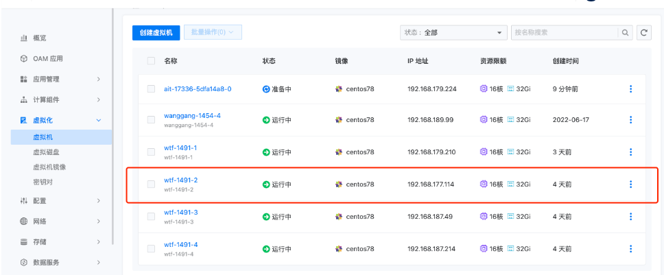

---
kind:
  - Troubleshooting
products:
  - Alauda Container Platform
  - Alauda DevOps
  - Alauda AI
  - Alauda Application Services
  - Alauda Service Mesh
  - Alauda Developer Portal
ProductsVersion:
  - 4.1.0,4.2.x
---
<!-- A type of document that involves encountering a fault, diagnosing it, performing root cause analysis, and providing solutions. -->

# Kubevirt虚拟机重启后ip发生变化需要更改为原来的ip地址

Kubevirt虚拟机重启后ip发生变化

## Cause
- kube-ovn定时gc机制在虚拟机暂停后删除对应lsp信息

## Resolution
- 升级OVN至1.8.7版本

## [workaround]
- 给vm指定固定IP地址，删除重建kube-ovn-controller的pod

## [Related Information]
**Screenshots**

- Environment: 3.8.1
- kube-ovn-controller
- lsp
- 固定IP配置
- Component: 虚拟机
- Page ID: 120094987
- Original Title: Kubevirt虚拟机重启后ip发生变化需要更改为原来的ip地址
