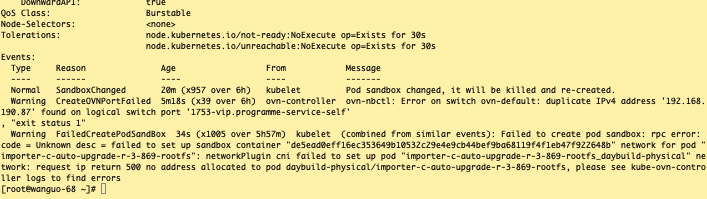
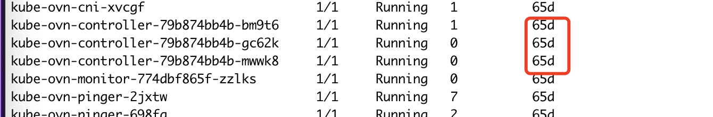
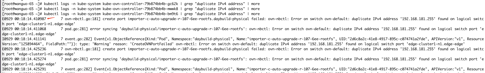
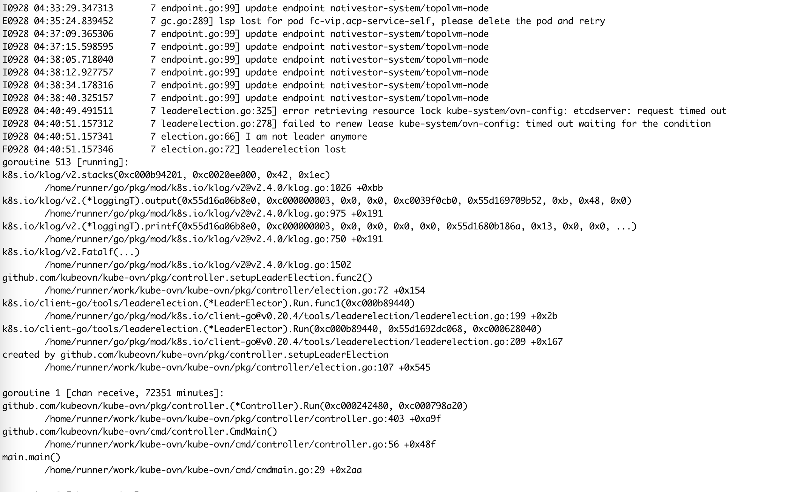
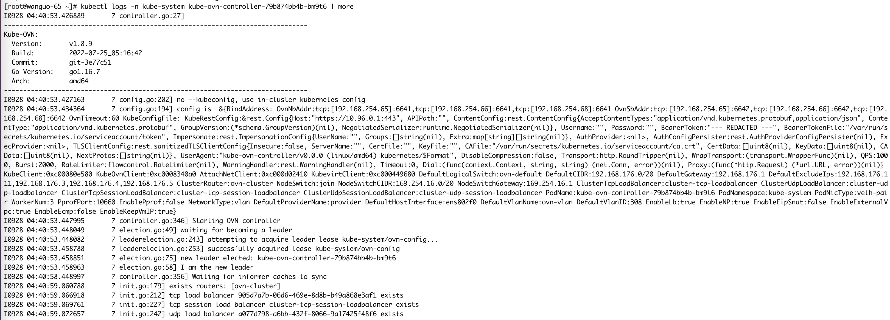
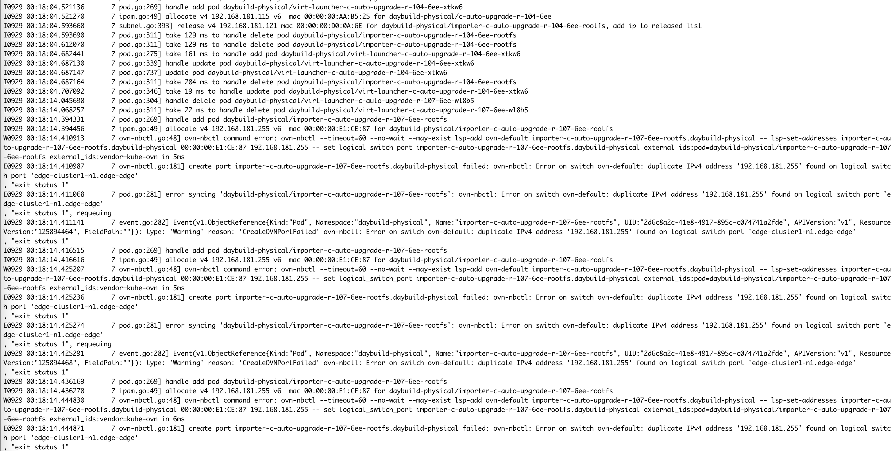
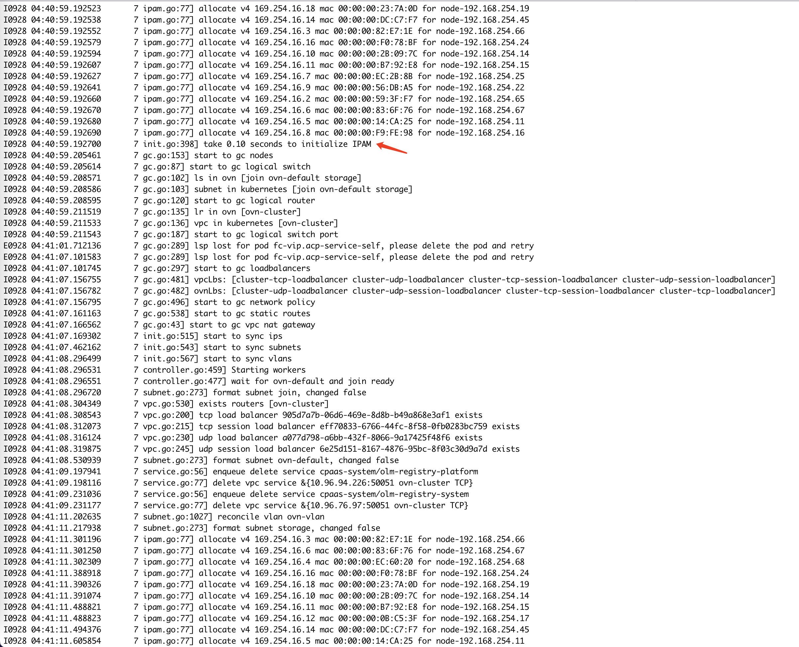
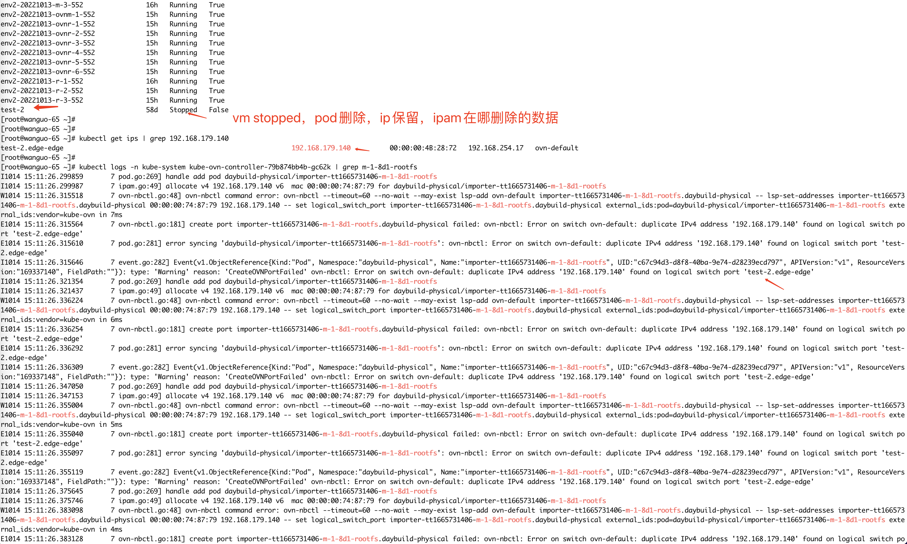
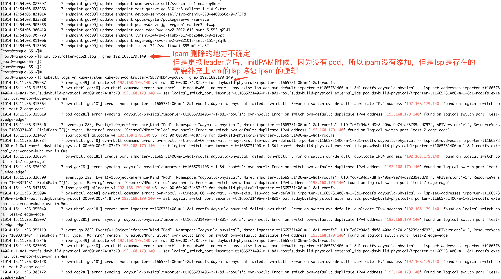

---
kind:
  - Troubleshooting
products:
  - Alauda Container Platform
  - Alauda DevOps
  - Alauda AI
  - Alauda Application Services
  - Alauda Service Mesh
  - Alauda Developer Portal
ProductsVersion:
  - 4.1.0,4.2.x
---
<!-- A type of document that involves encountering a fault, diagnosing it, performing root cause analysis, and providing solutions. -->

# 2022

虚拟机启动失败，kube-ovn-controller 报错 IP地址已被其他LSP占用 kube-ovn-controller Pod 重启后首次出现地址冲突

## Cause
- kube-ovn-controller 重启后，initIPAM 未恢复非 running 状态 Pod 的 IPAM 记录
- 残留的 LSP 占用 IP 未被 IPAM 识别，导致后续分配冲突

## Resolution
- 重启 kube-ovn-controller 恢复 IPAM 记录
- 修改 initIPAM 逻辑：恢复所有状态 Pod 的 IP 记录，依赖 LSP GC 释放残留 IP
- 升级 kube-ovn 至 v1.8.13（含 leader 切换 lease 修复）

## [workaround]
- 临时重启 kube-ovn-controller 恢复 IPAM

## [Related Information]
**Screenshots**

- Environment: Kubernetes 1.21.10, kube-ovn v1.8.9
- kube-ovn-controller
- LSP (Logical Switch Port)
- initIPAM
- IPAM 恢复逻辑
- Component: 虚拟化
- Page ID: 127416279
- Original Title: 2022-10-13  内部虚拟化环境，出现IP地址冲突问题
