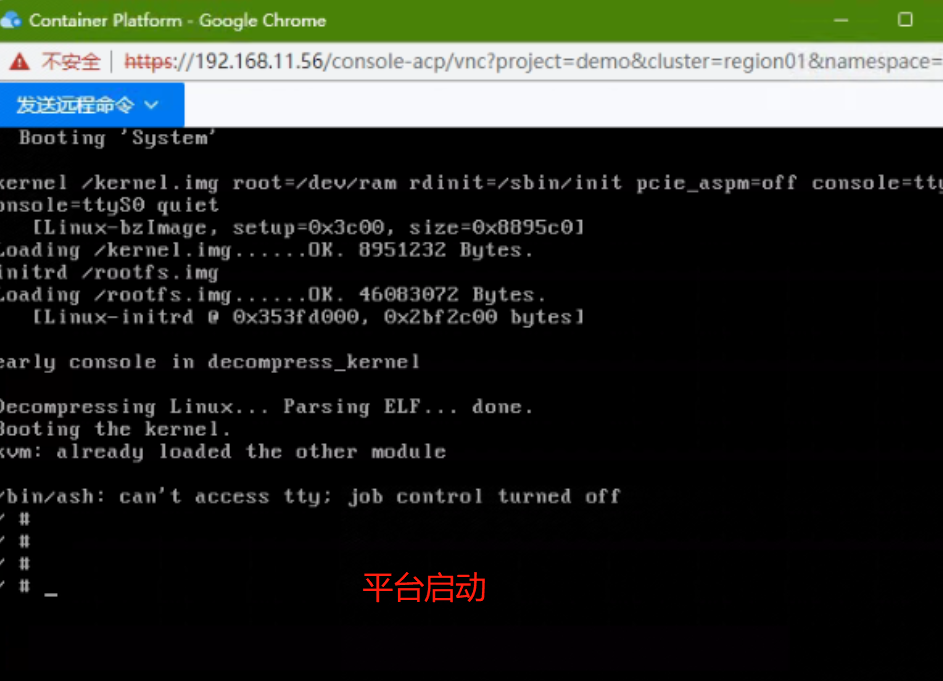
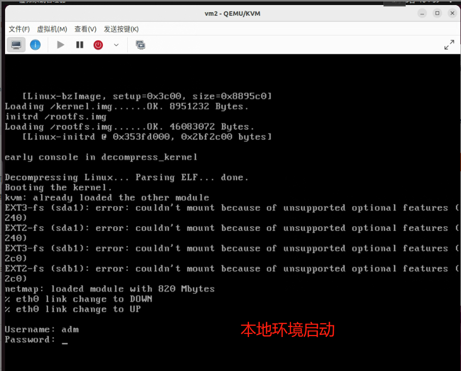
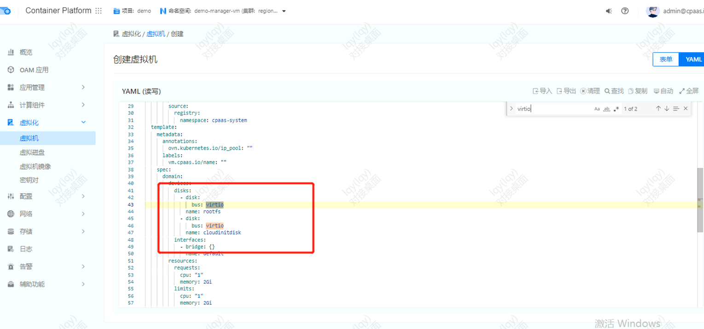

---
kind:
  - Troubleshooting
products:
  - Alauda Container Platform
  - Alauda DevOps
  - Alauda AI
  - Alauda Application Services
  - Alauda Service Mesh
  - Alauda Developer Portal
ProductsVersion:
  - 4.1.0,4.2.x
---
<!-- A type of document that involves encountering a fault, diagnosing it, performing root cause analysis, and providing solutions. -->

# 使用qcow2格式镜像创建虚拟机启动问题

使用qcow2格式镜像创建的虚拟机无法进入系统 虚拟机能够正常启动但无法登录

## Cause
- 镜像不支持virtio磁盘驱动
- 平台默认使用virtio磁盘总线类型

## Resolution
- 修改虚拟机YAML配置中的磁盘总线类型：
    domain:
      devices:
        disks:
        - disk:
            bus: sata
          name: rootdisk

## [workaround]

## [Related Information]
**Screenshots**

- Environment: 3.8, 3.10
- kubevirt
- 虚拟机YAML配置
- virtio
- sata
- qcow2镜像格式
- disk总线配置
- Component: 虚拟机
- Page ID: 139659138
- Original Title: 容器平台-使用qcow2格式镜像创建虚拟机启动问题
