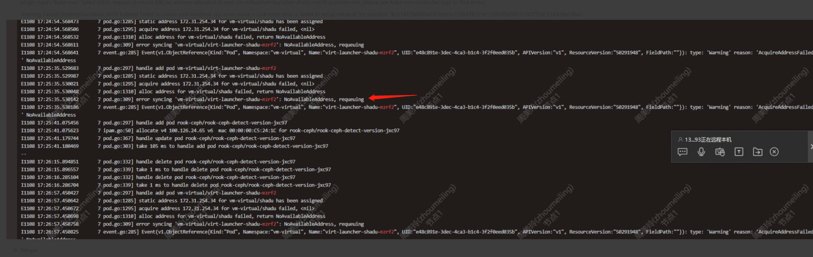
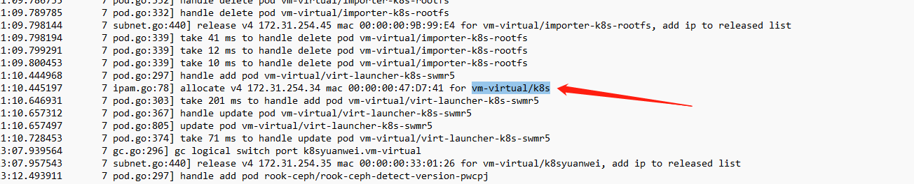
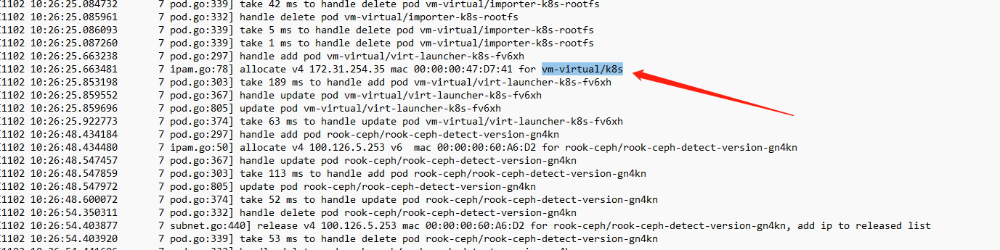

---
kind:
  - Troubleshooting
products:
  - Alauda Container Platform
  - Alauda DevOps
  - Alauda AI
  - Alauda Application Services
  - Alauda Service Mesh
  - Alauda Developer Portal
ProductsVersion:
  - 4.1.0,4.2.x
---
<!-- A type of document that involves encountering a fault, diagnosing it, performing root cause analysis, and providing solutions. -->

# 虚拟机创建失败

虚机创建失败，log有ip冲突 IP地址172.31.254.34未释放

## Cause
- kube-ovn-controller未收到删除pod请求
- 未进入handle delete pod逻辑

## Resolution
- 重启kube-ovn-controller

## [workaround]

## [Related Information]
**Screenshots**

- Environment: CNI版本：v1.9.25
- kube-ovn-controller
- 172.31.254.34
- 172.31.254.35
- Component: 虚拟机
- Page ID: 170363847
- Original Title: 虚拟机创建失败
