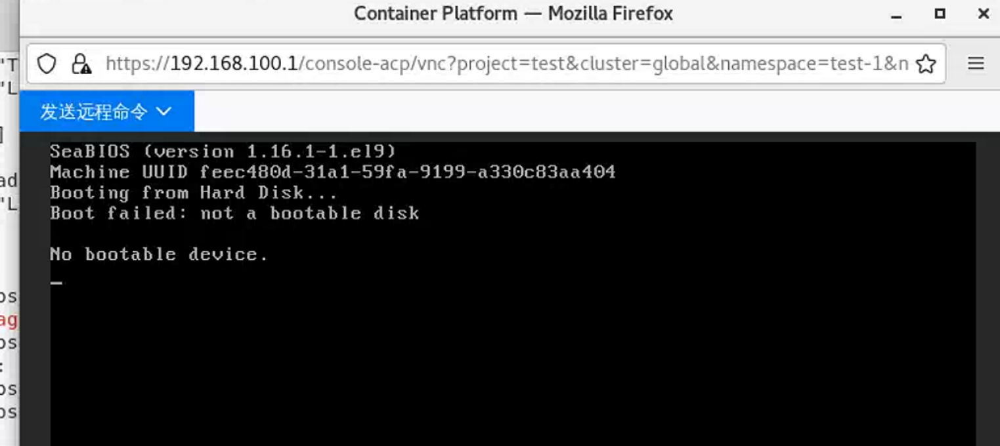
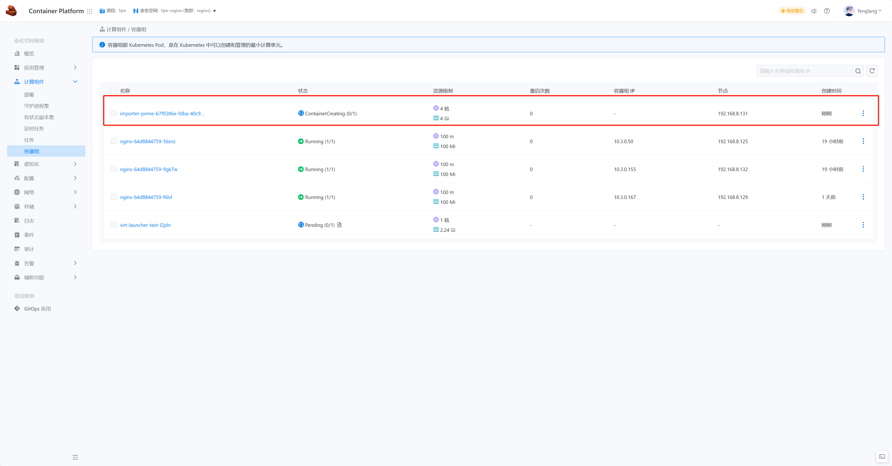
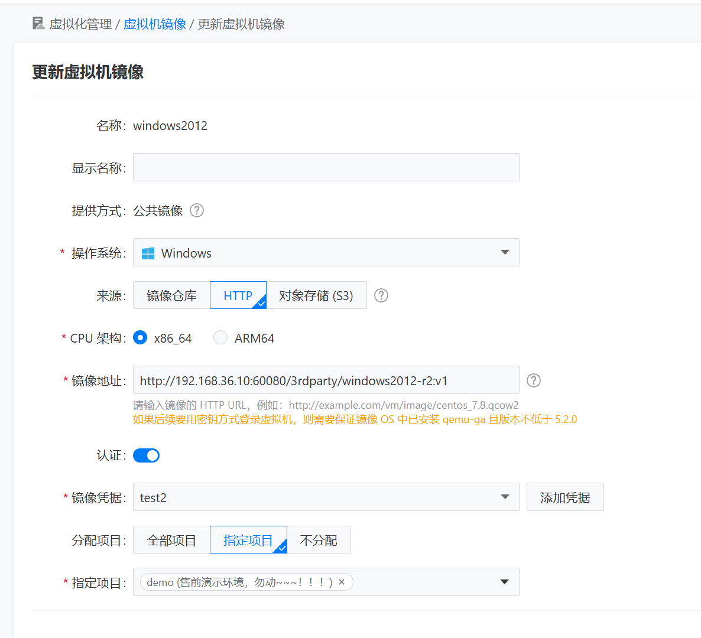
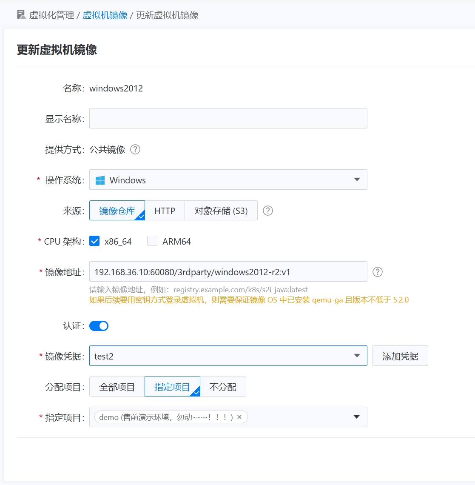
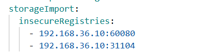

---
kind:
  - Troubleshooting
products:
  - Alauda Container Platform
  - Alauda DevOps
  - Alauda AI
  - Alauda Application Services
  - Alauda Service Mesh
  - Alauda Developer Portal
ProductsVersion:
  - 4.1.0,4.2.x
---
<!-- A type of document that involves encountering a fault, diagnosing it, performing root cause analysis, and providing solutions. -->

# kubevirt启动windows虚拟机显示"No Bootable Device"

启动windows虚拟机后，VNC登录显示'No Bootable Device' importer任务仅需几秒就completed importer日志报错：nbdkit: curl[2]: error: readahead: warning: underlying plugin does not support NBD_CMD_CACHE或PARALLEL thread model

## Cause
- 镜像源配置错误(HTTP模板与镜像仓库存储方式不匹配)
- 未将Harbor地址添加到KubeVirt的insecureRegistries配置项

## Resolution
- 修改镜像配置为镜像仓库模板
- 在kubevirt-hyperconverged资源实例的YAML中，将Harbor地址添加到spec.storageImport.insecureRegistries字段
- 重新部署虚拟机

## [workaround]

## [Related Information]
**Screenshots**

- Environment: 3.16.1
- HTTP模板
- 镜像仓库模板
- spec.storageImport.insecureRegistries
- kubevirt-hyperconverged资源实例
- nbdkit
- Component: 虚拟机
- Page ID: 228558875
- Original Title: kubevirt启动windows虚拟机显示"No Bootable Device"
