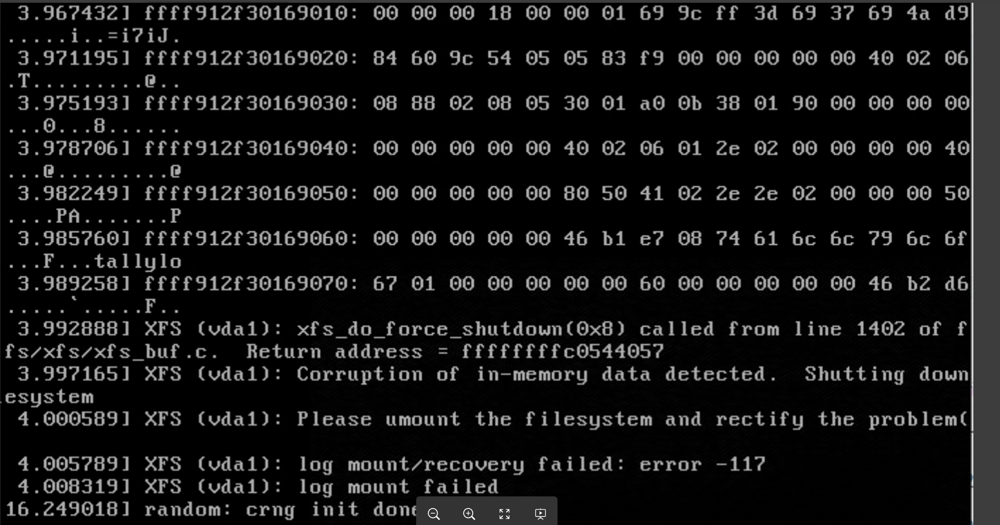
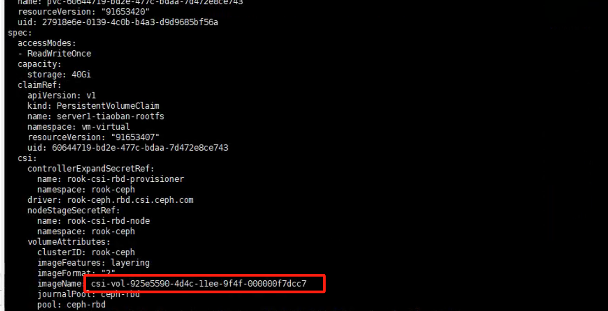
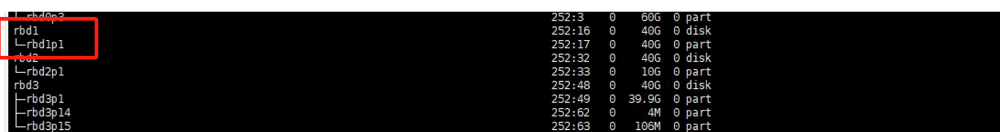
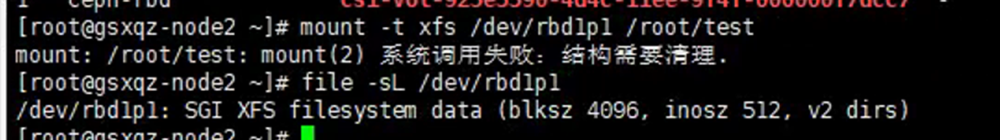

---
kind:
  - Troubleshooting
products:
  - Alauda Container Platform
  - Alauda DevOps
  - Alauda AI
  - Alauda Application Services
  - Alauda Service Mesh
  - Alauda Developer Portal
ProductsVersion:
  - 4.1.0,4.2.x
---
<!-- A type of document that involves encountering a fault, diagnosing it, performing root cause analysis, and providing solutions. -->

# 虚拟机报错文件系统损坏无法进入

虚拟机报错文件系统损坏无法进入 挂载测试验证文件系统时确认损坏

## Cause

## Resolution
- 执行 xfs_repair /dev/rdb1p1 进行修复
- 执行 xfs_repair -L /dev/rdb1p1 强制修复（需提前备份）

## [workaround]

## [Related Information]
**Screenshots**

- Environment: 3.12.2
- rbd
- csi-rbdplugin
- xfs
- /dev/rbd1p1
- PV
- PVC
- Component: 虚拟机
- Page ID: 247497723
- Original Title: 虚拟机报错文件系统损坏无法进入-ceph块存储-xfs文件系统
