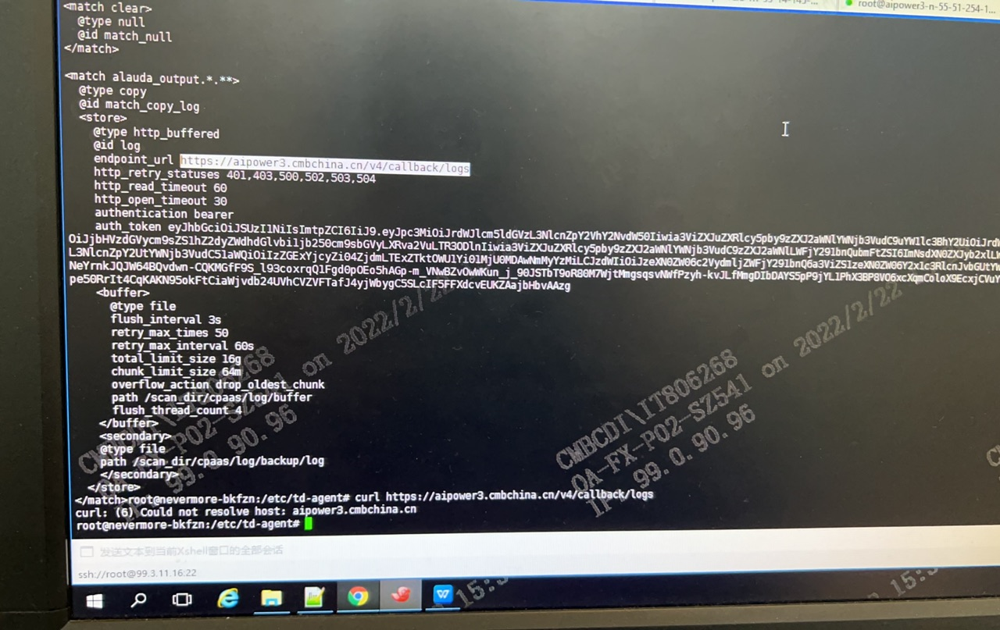

---
kind:
  - Troubleshooting
products:
  - Alauda Container Platform
  - Alauda DevOps
  - Alauda AI
  - Alauda Application Services
  - Alauda Service Mesh
  - Alauda Developer Portal
ProductsVersion:
  - 4.1.0,4.2.x
---
<!-- A type of document that involves encountering a fault, diagnosing it, performing root cause analysis, and providing solutions. -->

# 3.4.2

nevermore一直重启，健康检查不通过 审计事件日志无呈现 容器内curl无法解析域名

## Cause
- coredns的cm文件hosts配置缺少fallthrough参数

## Resolution
- 修改coredns的cm文件添加fallthrough配置
- 重启coredns服务

## [workaround]

## [Related Information]
**Screenshots**

- Environment: 3.4.2
- coredns
- nevermore
- /etc/td-agent/match.conf
- endpoint_url
- global地址
- hosts配置
- Component: CoreDNS
- Page ID: 108108390
- Original Title: 3.4.2-容器平台-可视化运维-业务集群日志组件异常
