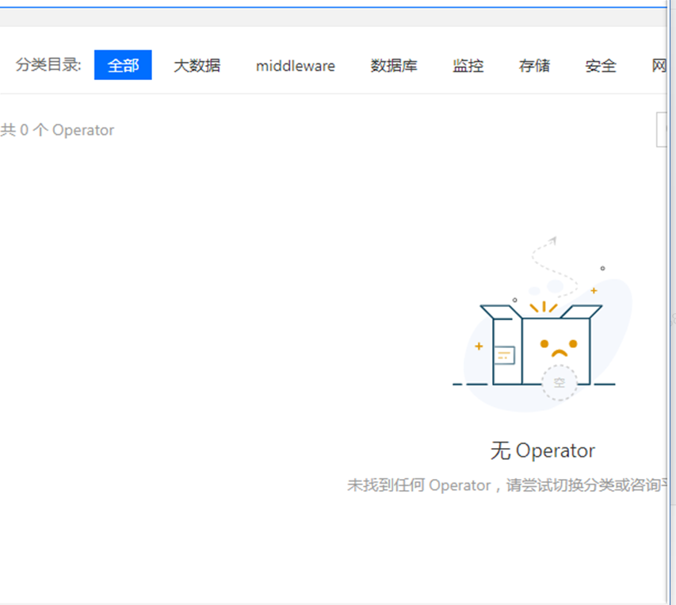
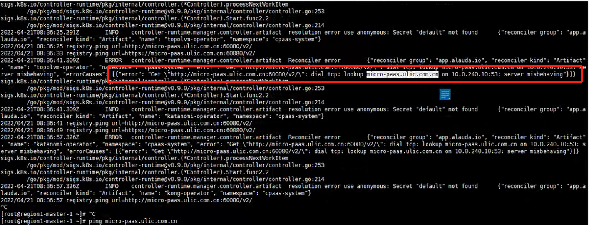

---
kind:
  - Troubleshooting
products:
  - Alauda Container Platform
  - Alauda DevOps
  - Alauda AI
  - Alauda Application Services
  - Alauda Service Mesh
  - Alauda Developer Portal
ProductsVersion:
  - 4.1.0,4.2.x
---
<!-- A type of document that involves encountering a fault, diagnosing it, performing root cause analysis, and providing solutions. -->

# 3.6 新建集群没有operator

新建业务集群没有operator global集群显示正常

## Cause
- coredns无法解析平台访问域名
- coredns的/etc/resolv.conf存在search域配置

## Resolution
- 删除slave节点的search域配置并重启coredns
- 在coredns的ConfigMap中添加平台域名解析的hosts字段

## [workaround]

## [Related Information]
**Screenshots**

- Environment: 3.x
- artifact-controller
- coredns
- /etc/resolv.conf
- kube-system命名空间
- ConfigMap配置
- Component: CoreDNS
- Page ID: 112060674
- Original Title: 3.6 新建集群没有operator
