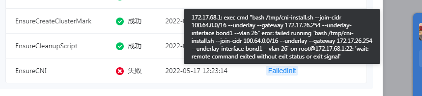
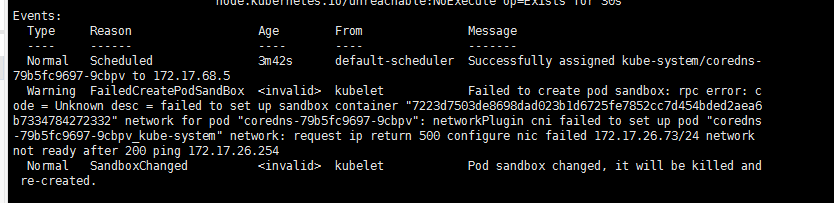
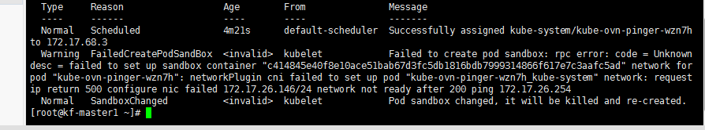
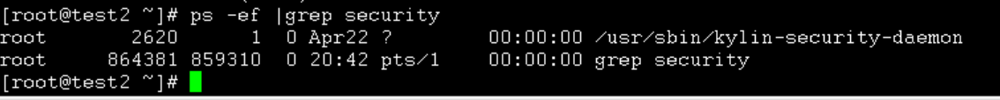

---
kind:
  - Troubleshooting
products:
  - Alauda Container Platform
  - Alauda DevOps
  - Alauda AI
  - Alauda Application Services
  - Alauda Service Mesh
  - Alauda Developer Portal
ProductsVersion:
  - 4.1.0,4.2.x
---
<!-- A type of document that involves encountering a fault, diagnosing it, performing root cause analysis, and providing solutions. -->

# 集群部署

coredns启动失败 kube-ovn-pinger启动失败

## Cause
- 麒麟OS物理机默认安装的安全插件导致OVN组件启动失败

## Resolution
- 登录节点执行检查命令：ps -ef |grep security
- 联系厂商确认后卸载安全插件

## [workaround]

## [Related Information]
**Screenshots**

- Environment: KylinOS物理机 (Linux test1 4.19.90-24.4.v2101.ky10.aarch64), 平台版本3.8.1
- coredns
- kube-ovn-pinger
- OVN组件
- security插件
- Component: CoreDNS
- Page ID: 115518525
- Original Title: 集群部署-业务集群创建-coredns kube-ovn-pinger启动失败
