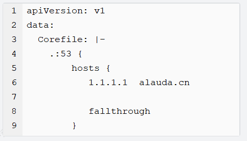

---
kind:
  - Troubleshooting
products:
  - Alauda Container Platform
  - Alauda DevOps
  - Alauda AI
  - Alauda Application Services
  - Alauda Service Mesh
  - Alauda Developer Portal
ProductsVersion:
  - 4.1.0,4.2.x
---
<!-- A type of document that involves encountering a fault, diagnosing it, performing root cause analysis, and providing solutions. -->

# coredns日志报错连接alauda.cn

coredns中发现大量[alauda.cn](http://alauda.cn)解析error日志

## Cause
- 平台组件会使用到alauda.cn地址进行解析，实际连通性不影响业务

## Resolution
- 修改coredns的ConfigMap，在hosts配置中添加alauda.cn解析

## [workaround]

## [Related Information]
**Screenshots**

- Environment: 3.6
- coredns ConfigMap
- kube-system命名空间
- hosts插件配置
- Component: CoreDNS
- Page ID: 119087533
- Original Title: coredns日志报错连接alauda.cn
