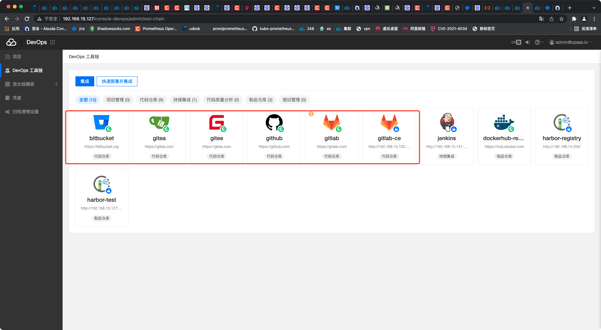

---
kind:
  - Troubleshooting
products:
  - Alauda Container Platform
  - Alauda DevOps
  - Alauda AI
  - Alauda Application Services
  - Alauda Service Mesh
  - Alauda Developer Portal
ProductsVersion:
  - 4.1.0,4.2.x
---
<!-- A type of document that involves encountering a fault, diagnosing it, performing root cause analysis, and providing solutions. -->

# coredns一直报错解析devops工具链里的域名失败

coredns持续解析harbor/gitee/git等公网域名失败 coredns日志显示timeout错误

## Cause
- 服务器无法访问外网
- 平台自带公网地址配置导致异常

## Resolution
- 删除devops工具链中的公网地址图标
- 升级到3.6+版本修复该问题

## [workaround]

## [Related Information]
**Screenshots**

- Environment: 3.4.2
- coredns配置
- devops工具链配置
- harbor
- gitee
- git
- Component: CoreDNS
- Page ID: 119087581
- Original Title: coredns一直报错解析devops工具链里的域名失败
