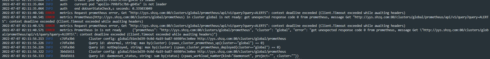
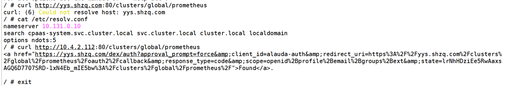

---
kind:
  - Troubleshooting
products:
  - Alauda Container Platform
  - Alauda DevOps
  - Alauda AI
  - Alauda Application Services
  - Alauda Service Mesh
  - Alauda Developer Portal
ProductsVersion:
  - 4.1.0,4.2.x
---
<!-- A type of document that involves encountering a fault, diagnosing it, performing root cause analysis, and providing solutions. -->

# 3.8.1

集群概览显示监控异常 apollo组件存在日志报错 alb容器内curl prometheus URL无法解析域名（使用IP可正常访问）

## Cause
- DNS search域导致svc解析错误

## Resolution
- 删除/etc/resolv.conf中的search字段
- 重启alb和apollo组件
- 部署时所有主机禁止配置dns search域

## [workaround]

## [Related Information]
**Screenshots**

- Environment: 3.8.1
- alb
- apollo
- /etc/resolv.conf
- search域
- Component: CoreDNS
- Page ID: 120113584
- Original Title: 3.8.1-基础架构-监控-管理集群监控显示功能异常
