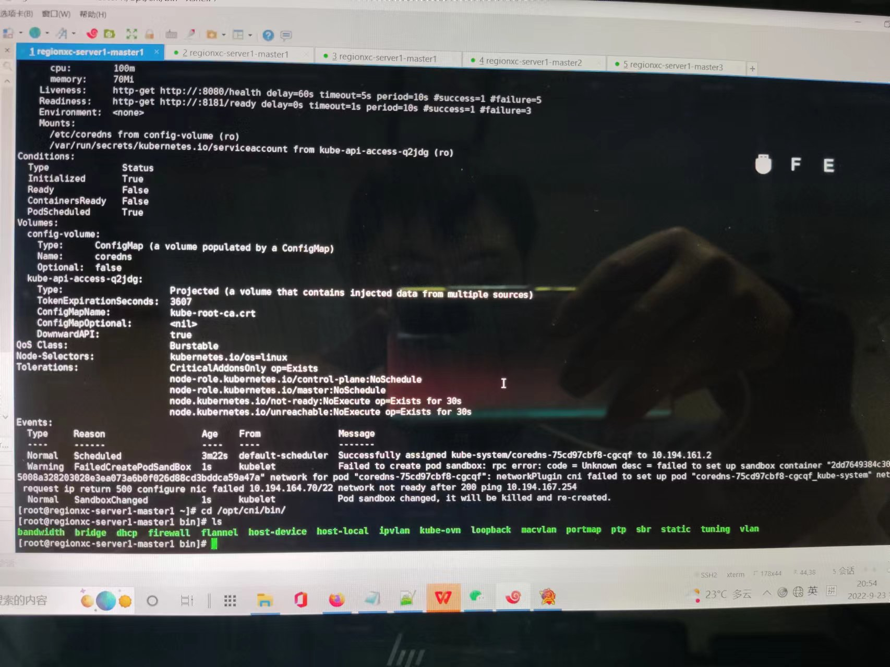
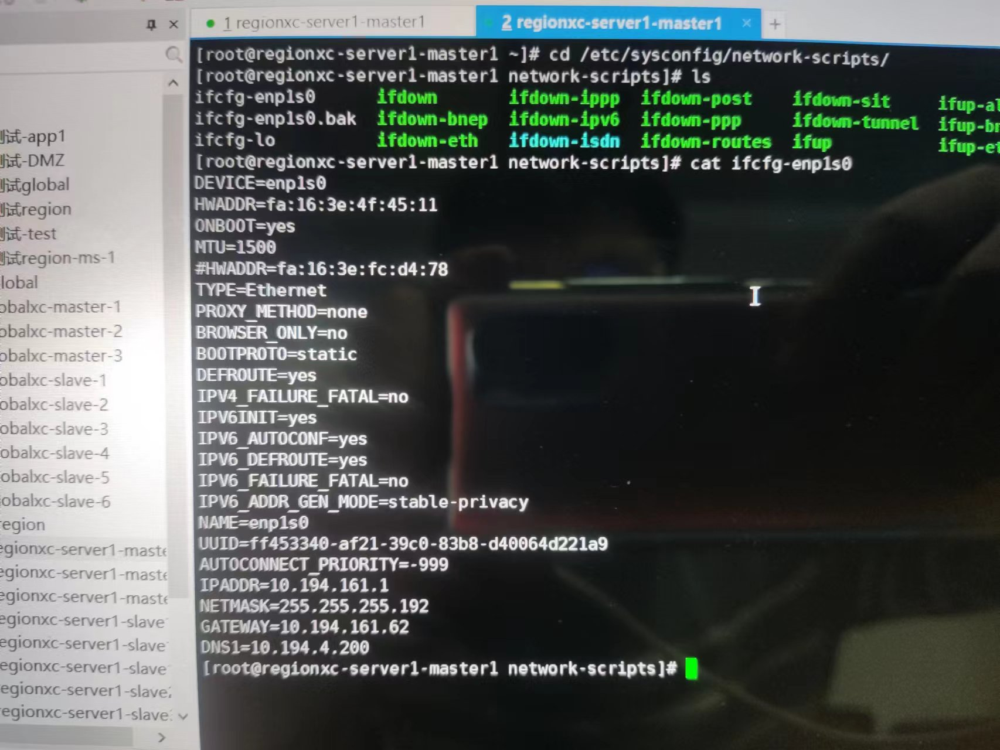
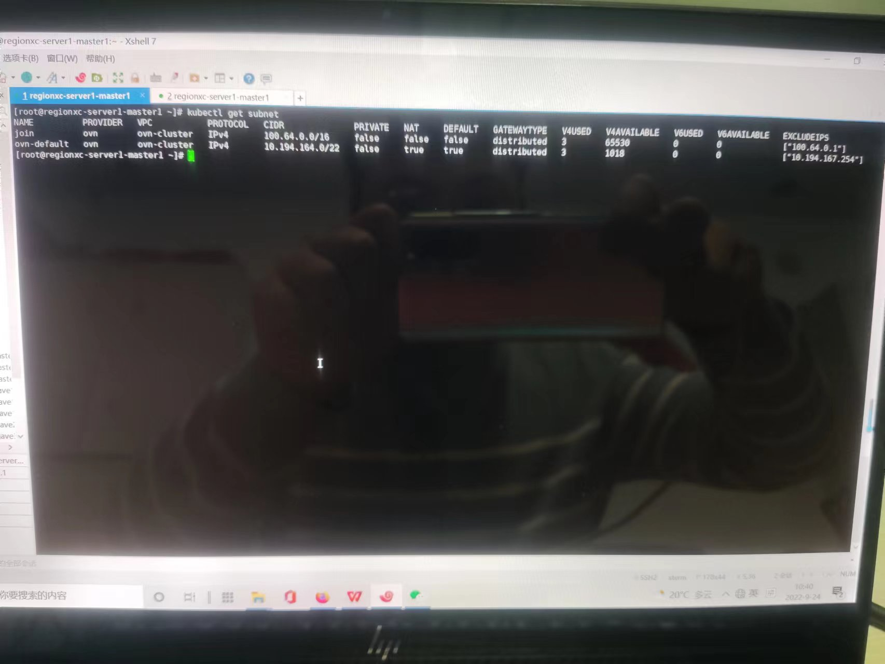
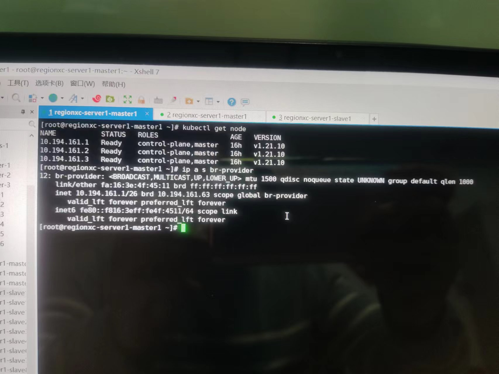
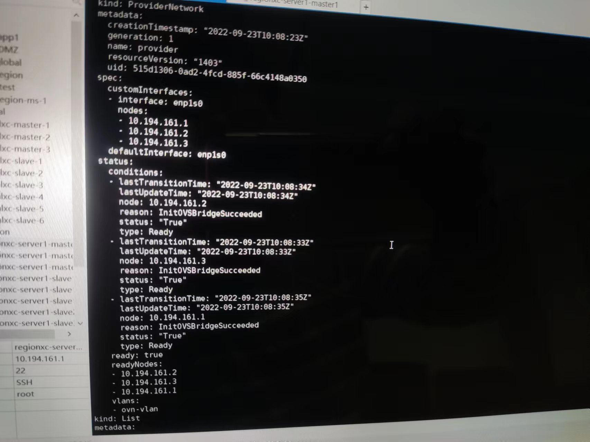
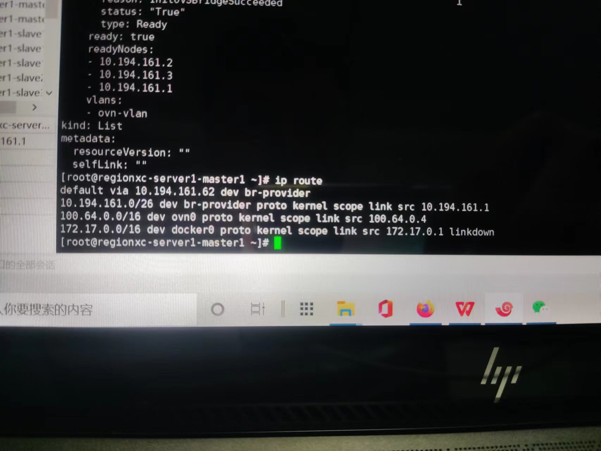
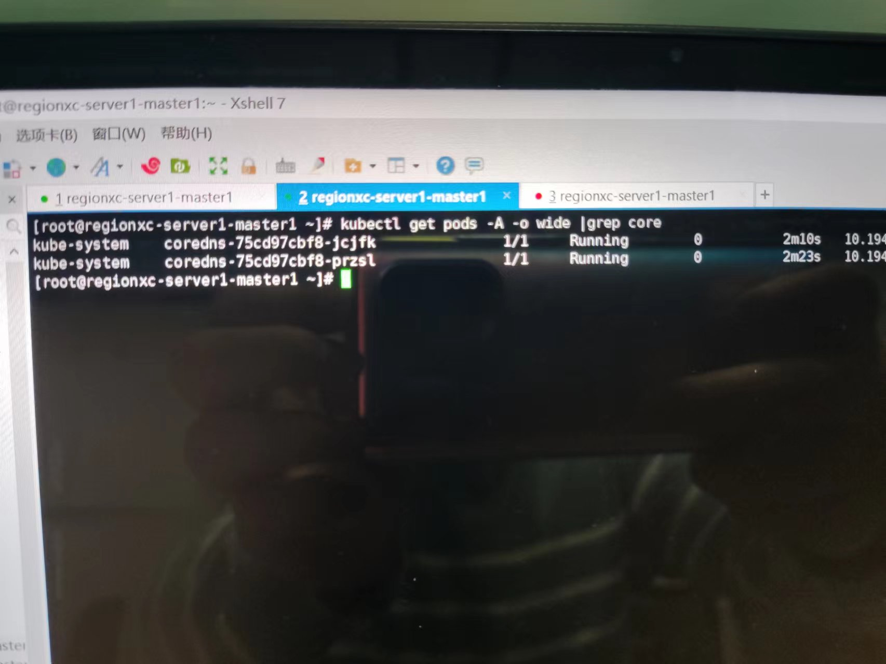

---kind:   - Troubleshootingproducts:    - Alauda Container Platform   - Alauda DevOps   - Alauda AI   - Alauda Application Services   - Alauda Service Mesh   - Alauda Developer PortalProductsVersion:   - 4.1.0,4.2.x---<!-- A type of document that involves encountering a fault, diag...it, performing root cause analysis, and providing solutions. --># 2022coredns pod起不来，报错pod访问网关失败## Cause- 单网卡无法同时处理不同vlan的节点网络和容器网络流量## Resolution- 在虚拟机上添加第二张网卡用于容器网络underlay部署，连接到交换机网关容器网络vlan接口## [workaround]## [Related Information]**Screenshots**- Environment: 麒麟v10, ACP3.8.1, kube-ovn v1.8- kube-ovn- coredns- enp1s0网卡- vlan子接口- provider-networks- Component: CoreDNS- Page ID: 127403857- Original Title: 2022-09-23 郑州银行，underlay部署问题