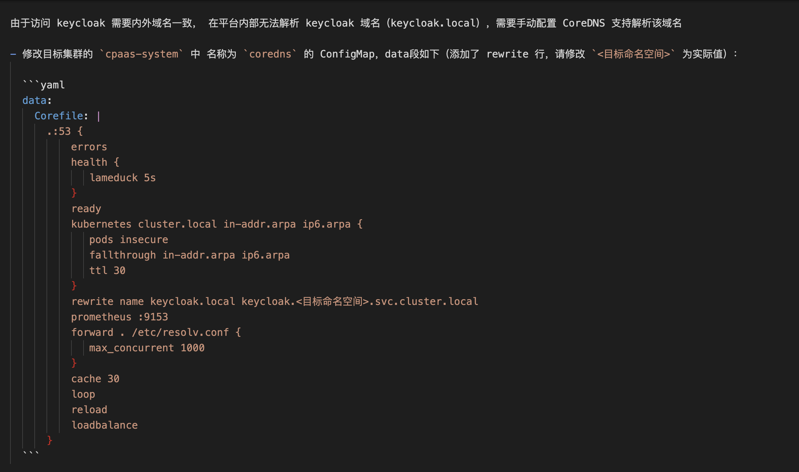

---kind:   - Troubleshootingproducts:    - Alauda Container Platform   - Alauda DevOps   - Alauda AI   - Alauda Application Services   - Alauda Service Mesh   - Alauda Developer PortalProductsVersion:   - 4.1.0,4.2.x---<!-- A type of document that involves encountering a fault, diag...it, performing root cause analysis, and providing solutions. --># 2022dns解析失败 pod的/etc/resolve.conf存在多余search localdomain配置## Cause- 节点/etc/resolve.conf存在多余search localdomain配置- pod继承错误search域配置## Resolution- 删除节点/etc/resolve.conf中多余的search localdomain配置## [workaround]## [Related Information]**Screenshots**- /etc/resolve.conf- search配置- coredns rewrite配置- glibc库- Component: CoreDNS- Page ID: 127421301- Original Title: 2022-10-13，coredns 解析问题