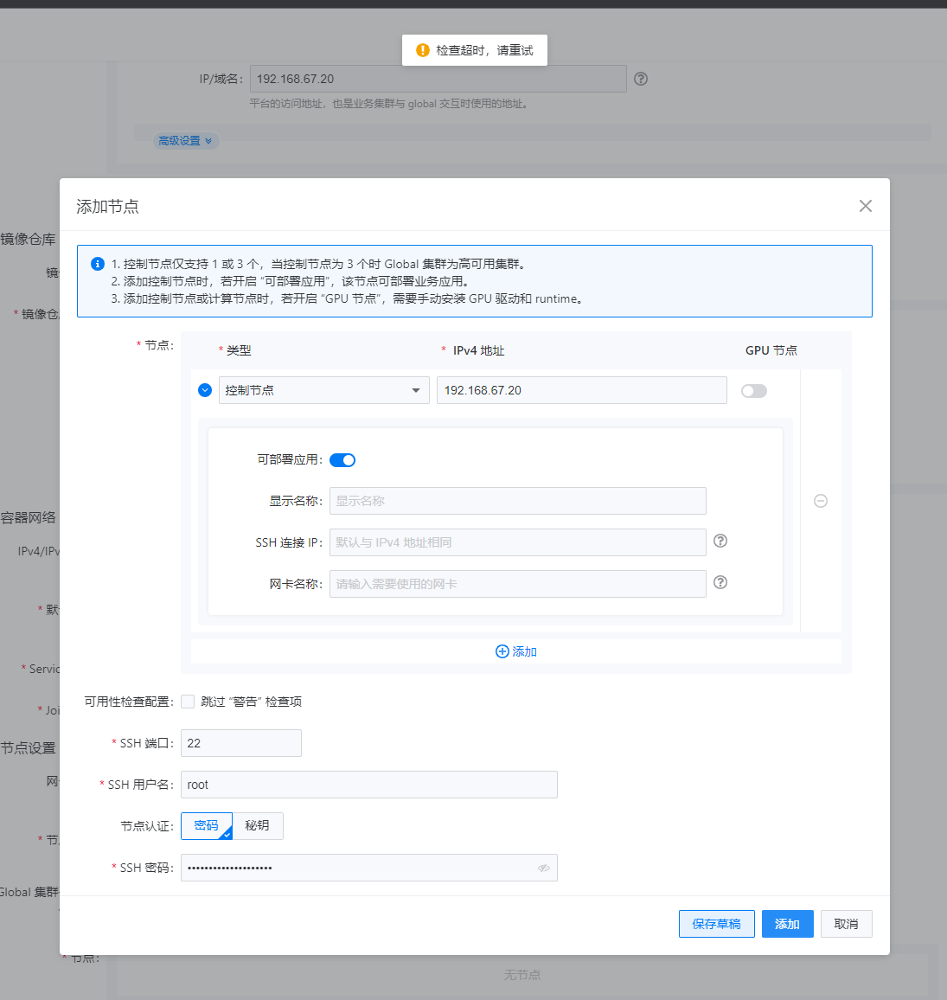
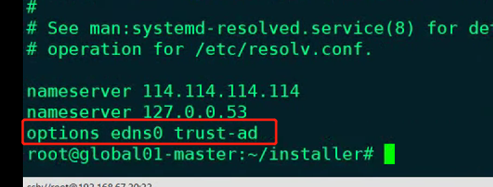

---
kind:
  - Troubleshooting
products:
  - Alauda Container Platform
  - Alauda DevOps
  - Alauda AI
  - Alauda Application Services
  - Alauda Service Mesh
  - Alauda Developer Portal
ProductsVersion:
  - 4.1.0,4.2.x
---
<!-- A type of document that involves encountering a fault, diagnosing it, performing root cause analysis, and providing solutions. -->

# 3.10部署平台节点检查超时

部署节点时立即出现检查超时 coredns pod处于CrashLoopBackOff状态

## Cause
- 节点/etc/resolv.conf存在options或search域配置

## Resolution
- 删除/etc/resolv.conf中的options/search配置
- 进入installer容器手动重启coredns
- 等待所有pod恢复正常后重试添加节点

## [workaround]

## [Related Information]
**Screenshots**

- Environment: ACP 3.10
- installer容器
- coredns
- /etc/resolv.conf
- kubectl
- registry容器
- setup.sh
- Component: CoreDNS
- Page ID: 127423405
- Original Title: 3.10部署平台节点检查超时
