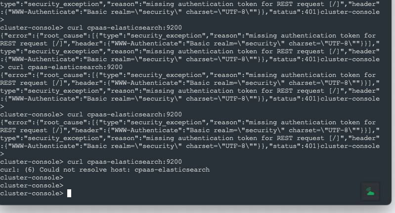
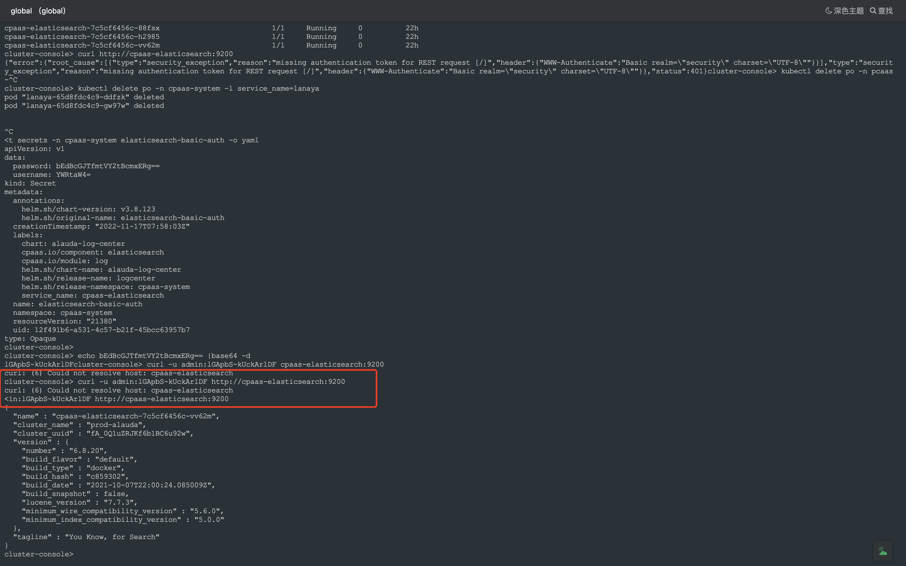
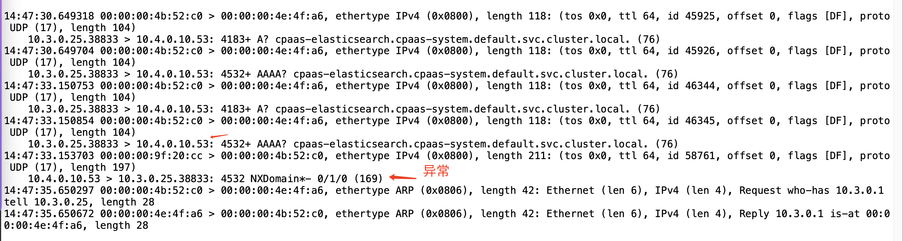
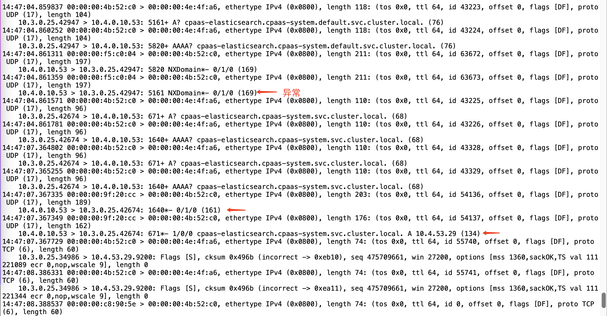
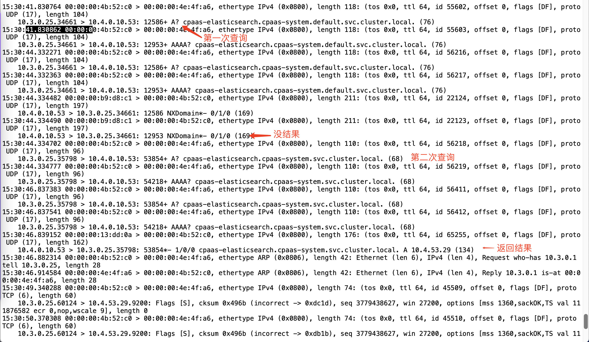

---
kind:
  - Troubleshooting
products:
  - Alauda Container Platform
  - Alauda DevOps
  - Alauda AI
  - Alauda Application Services
  - Alauda Service Mesh
  - Alauda Developer Portal
ProductsVersion:
  - 4.1.0,4.2.x
---
<!-- A type of document that involves encountering a fault, diagnosing it, performing root cause analysis, and providing solutions. -->

# 凝思OS适配，svc name访问存在时断时续的现象

coredns解析svc时出现时断时续的NXDomain返回 业务访问svc异常但nslookup正常 抓包显示coredns交替返回NXDomain和正常解析结果

## Cause
- coredns 1.7.0版本存在IPv6 svc地址解析缺陷
- kube-ovn v1.8.9与coredns 1.7.0存在兼容性问题

## Resolution
- 升级coredns到1.8版本镜像
- 更换CNI为calico进行验证

## [workaround]

## [Related Information]
**Screenshots**

- Environment: 凝思OS/Kubernetes适配3.8版本/kube-ovn v1.8.9/coredns 1.7.0
- coredns
- kube-ovn
- calico
- coredns镜像版本
- IPv6 svc解析
- Component: CoreDNS
- Page ID: 130571377
- Original Title: 凝思OS适配，svc name访问存在时断时续的现象
