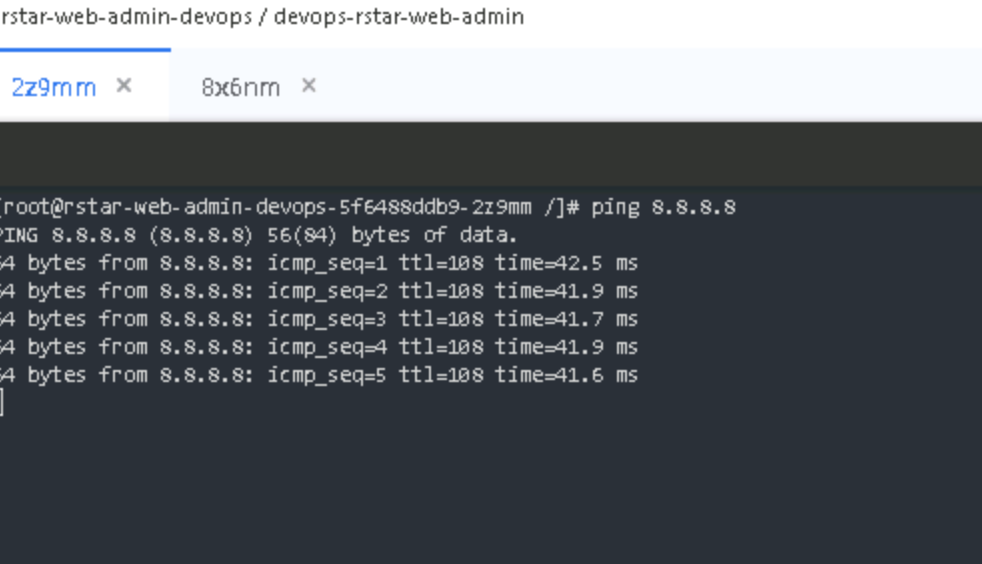
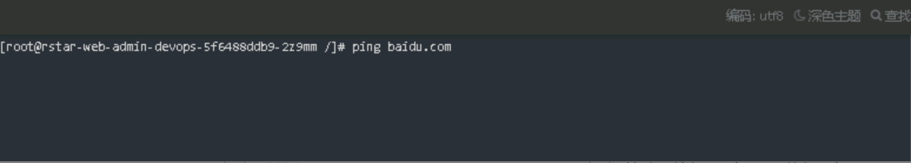
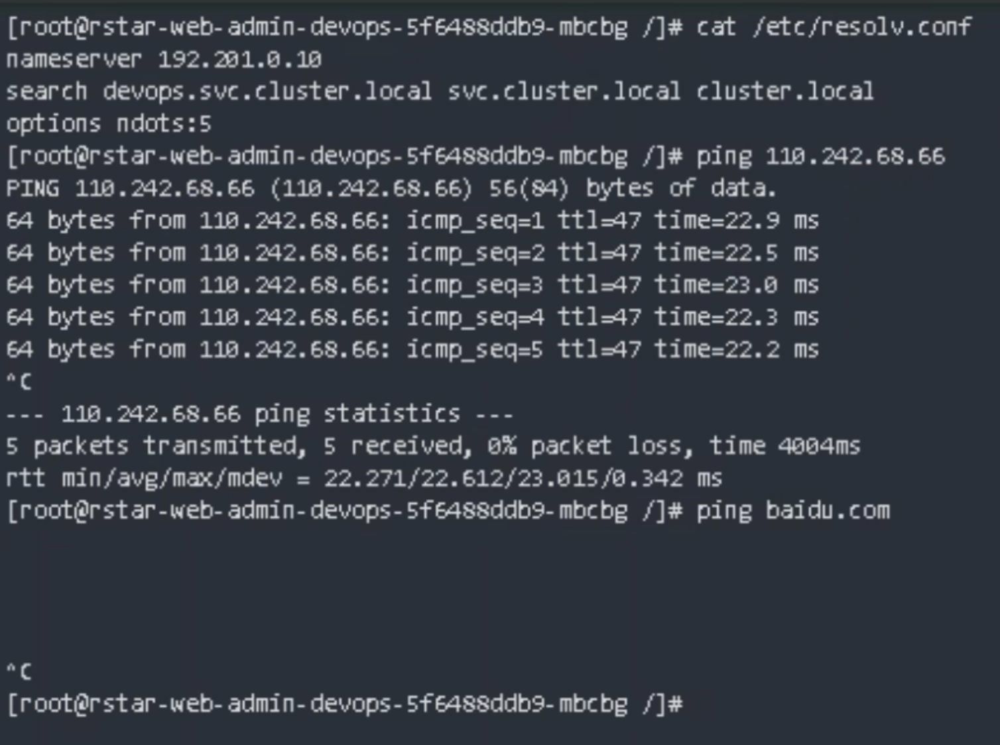

---
kind:
  - Troubleshooting
products:
  - Alauda Container Platform
  - Alauda DevOps
  - Alauda AI
  - Alauda Application Services
  - Alauda Service Mesh
  - Alauda Developer Portal
ProductsVersion:
  - 4.1.0,4.2.x
---
<!-- A type of document that involves encountering a fault, diagnosing it, performing root cause analysis, and providing solutions. -->

# Underlay网络svc名称无法访问

无法解析baidu等域名 devops名称空间内的域名解析异常

## Cause
- underlay子网访问overlay的coredns地址不通

## Resolution
- 配置双网卡实现underlay/overlay网络互通
- 调整网络策略允许underlay访问overlay的coredns

## [workaround]

## [Related Information]
**Screenshots**

- Environment: TKE 3.8.1
- coredns
- underlay网络
- overlay网络
- devops名称空间
- Component: CoreDNS
- Page ID: 133076120
- Original Title: Underlay网络svc名称无法访问
