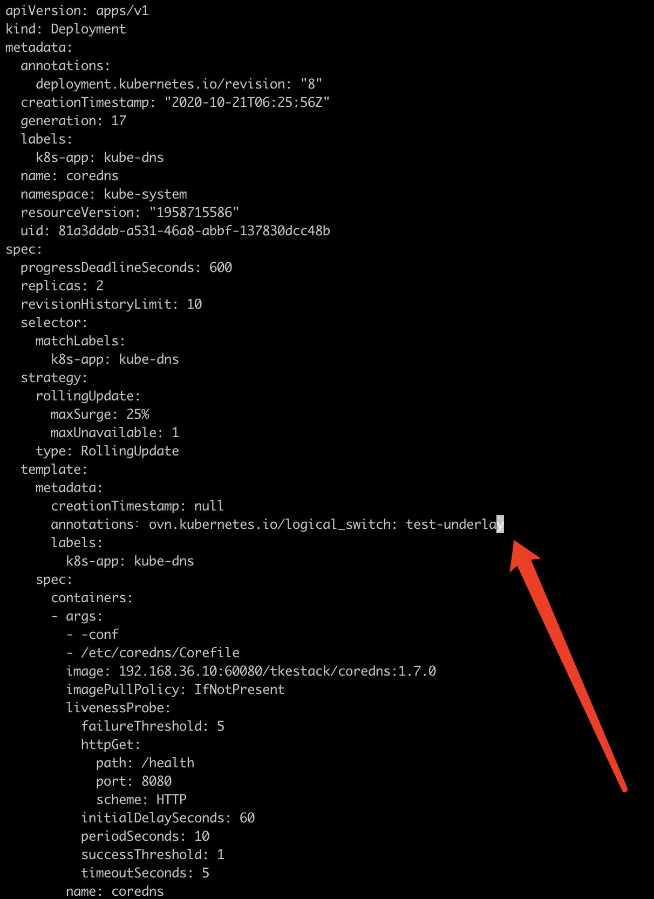

---
kind:
  - Troubleshooting
products:
  - Alauda Container Platform
  - Alauda DevOps
  - Alauda AI
  - Alauda Application Services
  - Alauda Service Mesh
  - Alauda Developer Portal
ProductsVersion:
  - 4.1.0,4.2.x
---
<!-- A type of document that involves encountering a fault, diagnosing it, performing root cause analysis, and providing solutions. -->

# 将coredns分配在underlay子网

无法连接到其他overlay子网下的域名

## Cause

## Resolution
- 在coredns Deployment模板中添加annotations: ovn.kubernetes.io/logical_switch: <subnet>

## [workaround]

## [Related Information]
**Screenshots**

- Environment: TKE 3.8.1
- ovn.kubernetes.io/logical_switch
- coredns Deployment
- Component: CoreDNS
- Page ID: 133076604
- Original Title: 将coredns分配在underlay子网
