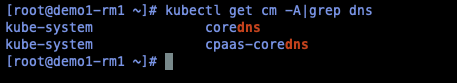

---
kind:
  - Troubleshooting
products:
  - Alauda Container Platform
  - Alauda DevOps
  - Alauda AI
  - Alauda Application Services
  - Alauda Service Mesh
  - Alauda Developer Portal
ProductsVersion:
  - 4.1.0,4.2.x
---
<!-- A type of document that involves encountering a fault, diagnosing it, performing root cause analysis, and providing solutions. -->

# 3.10

域名解析不通 hosts配置不生效

## Cause
- 3.10版本后coredns配置文件从coredns-cm变更为cpaas-coredns
- 旧配置未迁移到新ConfigMap

## Resolution
- 检查cpaas-coredns配置
- 将原有coredns-cm配置内容迁移到cpaas-coredns配置

## [workaround]

## [Related Information]
**Screenshots**

- Environment: 3.10.x
- cpaas-coredns
- coredns-cm
- kube-system命名空间
- Component: CoreDNS
- Page ID: 136531219
- Original Title: 3.10-coredns-cm配置hosts解析
