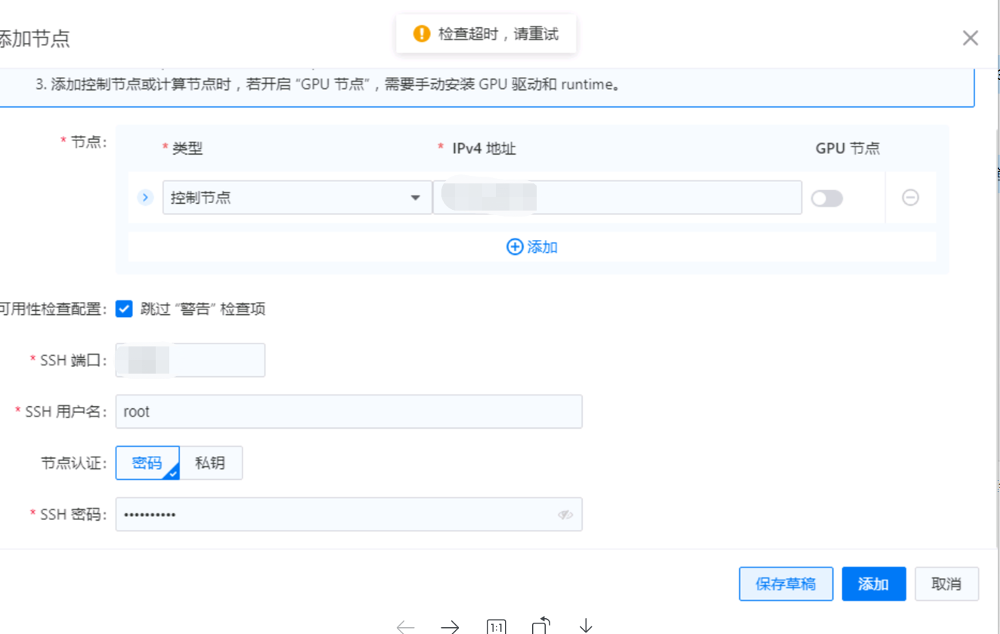
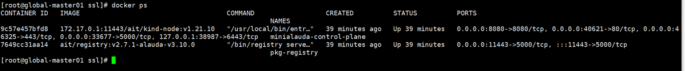
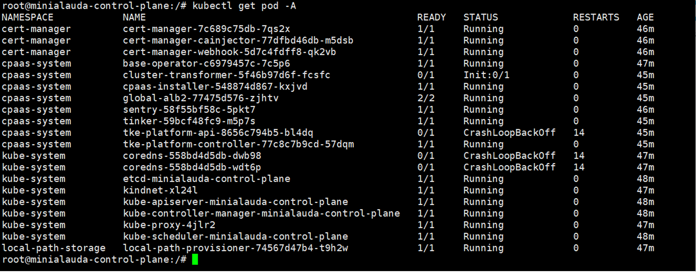
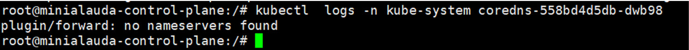
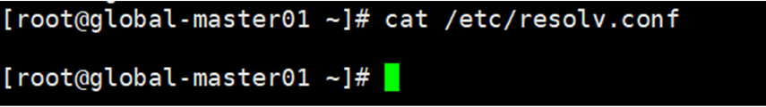

---
kind:
  - Troubleshooting
products:
  - Alauda Container Platform
  - Alauda DevOps
  - Alauda AI
  - Alauda Application Services
  - Alauda Service Mesh
  - Alauda Developer Portal
ProductsVersion:
  - 4.1.0,4.2.x
---
<!-- A type of document that involves encountering a fault, diagnosing it, performing root cause analysis, and providing solutions. -->

# 3.10

添加节点显示检查超时 coredns容器未启动 kubectl logs显示'no nameserver found'错误

## Cause
- 节点上的/etc/resolv.conf文件为空导致coredns无法解析域名

## Resolution
- 在/etc/resolv.conf文件中添加nameserver配置
- 重启受影响的容器

## [workaround]

## [Related Information]
**Screenshots**

4、使用kubectl logs -f查看coredns的日志，报错no nameserver found

- Environment: 3.10版本部署平台，使用setup.sh脚本启动installer和registry容器
- coredns
- /etc/resolv.conf
- installer容器
- registry容器
- setup.sh
- kubectl
- Component: CoreDNS
- Page ID: 136537495
- Original Title: 3.10-安装部署-部署集群添加节点超时
