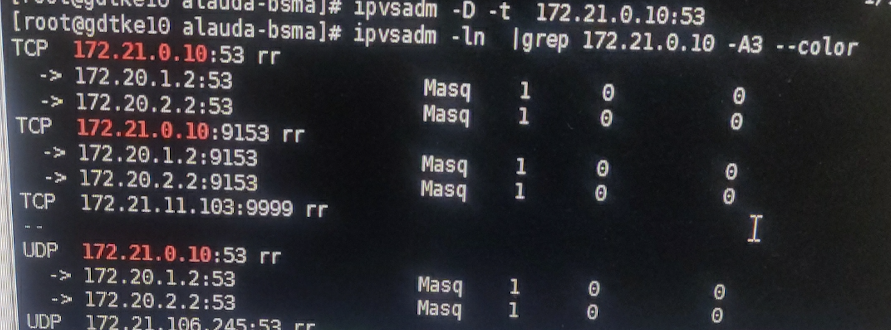
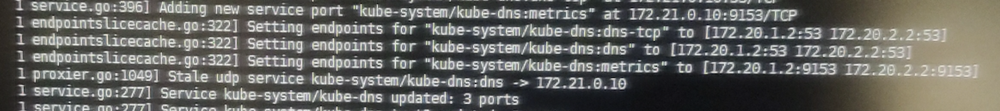
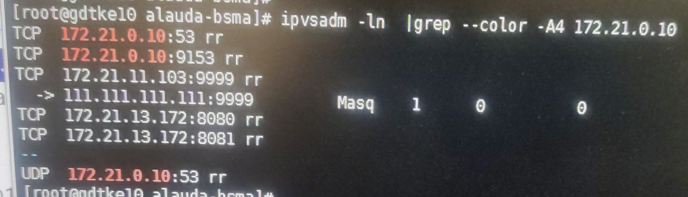
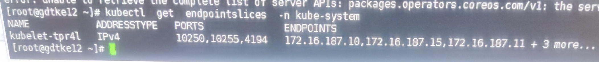

---kind:   - Troubleshootingproducts:    - Alauda Container Platform   - Alauda DevOps   - Alauda AI   - Alauda Application Services   - Alauda Service Mesh   - Alauda Developer PortalProductsVersion:   - 4.1.0,4.2.x---<!-- A type of document that involves encountering a fault, diag...it, performing root cause analysis, and providing solutions. --># 【flannel】Pod 无法解析 Service 域名Pod 无法解析 Service 域名，日志报错：lookup system.cpass-system.svc on 172.21.0.10:53: read udp xxxxx -> 172.21.0.10:53 i/o timeout 节点通过 Service IP 解析域名失败，Pod IP 解析正常 CoreDNS 的 IPVS real server 与实际 Pod IP 不一致## Cause- kube-apiserver 关闭了 EndpointSlice feature gate- kube-proxy 未关闭 EndpointSliceProxying 导致依赖 EndpointSlice 同步失败## Resolution- 在 kube-proxy 的 ConfigMap 中关闭 EndpointSliceProxying## [workaround]## [Related Information]**Screenshots**- Environment: Kubernetes v1.19, flannel CNI- kube-proxy- kube-apiserver- EndpointSlice- kube-dns- CoreDNS- IPVS- /etc/kubernetes/manifests/kube-apiserver.yaml- Component: CoreDNS- Page ID: 136541717- Original Title: 【flannel】Pod 无法解析 Service 域名