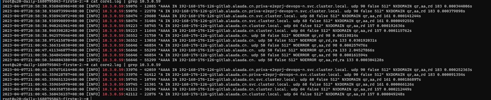
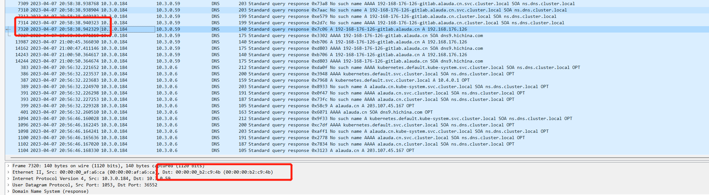
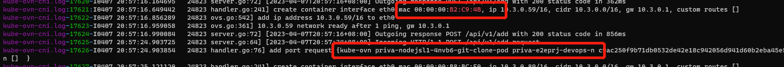
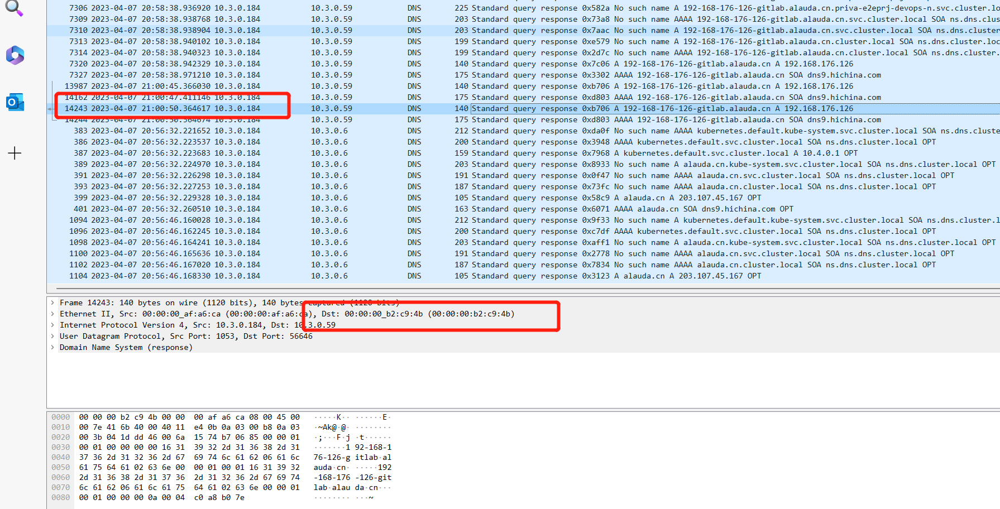
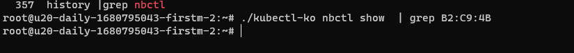
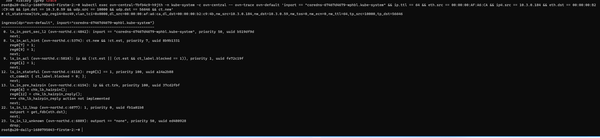

---
kind:
  - Troubleshooting
products:
  - Alauda Container Platform
  - Alauda DevOps
  - Alauda AI
  - Alauda Application Services
  - Alauda Service Mesh
  - Alauda Developer Portal
ProductsVersion:
  - 4.1.0,4.2.x
---
<!-- A type of document that involves encountering a fault, diagnosing it, performing root cause analysis, and providing solutions. -->

# coredns 问题

DNS查询失败 新Pod使用历史IP时域名解析失败 coredns日志显示相同IP的DNS查询有时成功有时失败

## Cause
- coredns ARP缓存未及时更新
- kube-ovn丢弃使用旧MAC地址的DNS响应包
- IP地址重用导致网络层信息不一致

## Resolution
- 调整coredns ARP缓存刷新机制
- 优化kube-ovn-controller的IP分配策略
- 检查ovn流表处理逻辑

## [workaround]
- 重启coredns强制刷新ARP缓存
- 避免Pod IP快速重用

## [Related Information]
**Screenshots**

- Environment: Kubernetes集群使用kube-ovn网络插件
- coredns
- kube-ovn-controller
- ovn
- arp-table
- mac-address
- kubectl ko
- Component: CoreDNS
- Page ID: 144904378
- Original Title: coredns 问题
