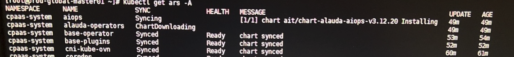

---
kind:
  - Troubleshooting
products:
  - Alauda Container Platform
  - Alauda DevOps
  - Alauda AI
  - Alauda Application Services
  - Alauda Service Mesh
  - Alauda Developer Portal
ProductsVersion:
  - 4.1.0,4.2.x
---
<!-- A type of document that involves encountering a fault, diagnosing it, performing root cause analysis, and providing solutions. -->

# 部署平台卡住

aiops/alauda-operators ars状态无法Ready sentry日志报错: failed to install chart for release describe artifacts显示无法解析平台域名

## Cause
- 容器内DNS解析失败
- 平台使用域名部署但未配置DNS

## Resolution
- 将平台域名解析配置到coredns的ConfigMap
- 重建coredns组件
- 等待组件自动恢复

## [workaround]

## [Related Information]
**Screenshots**

- Environment: 版本: 3.12.1 | 部署方式: 域名部署 | DNS状态: 无DNS配置
- coredns
- artifacts
- aiops
- alauda-operators
- 平台域名解析配置
- Component: CoreDNS
- Page ID: 149594399
- Original Title: 部署平台卡住
