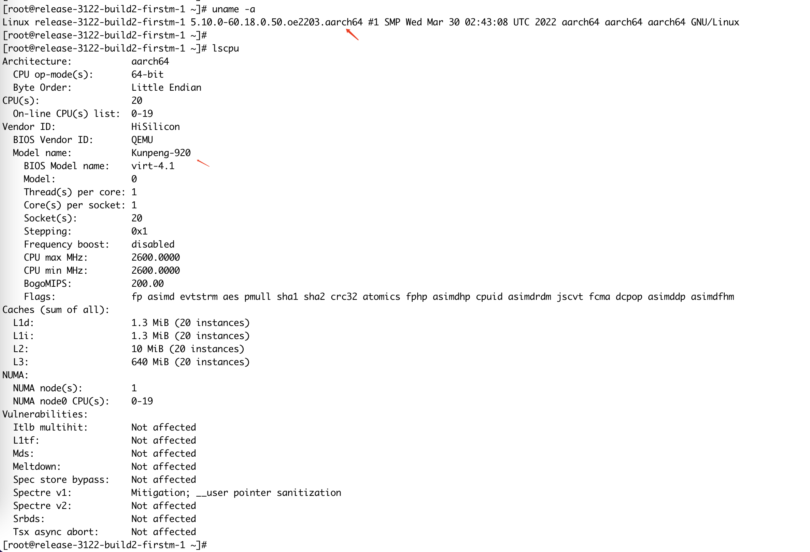

---
kind:
  - Troubleshooting
products:
  - Alauda Container Platform
  - Alauda DevOps
  - Alauda AI
  - Alauda Application Services
  - Alauda Service Mesh
  - Alauda Developer Portal
ProductsVersion:
  - 4.1.0,4.2.x
---
<!-- A type of document that involves encountering a fault, diagnosing it, performing root cause analysis, and providing solutions. -->

# 3.12.2 arm，欧拉系统，双栈 calico dns 解析超时

DNS解析超时 请求未到达CoreDNS Pod UDP报文存在checksum error计数

## Cause
- Calico vxlan.calico网卡UDP校验和问题

## Resolution
- 关闭vxlan.calico网卡的UDP校验和校验功能

## [workaround]

## [Related Information]
**Screenshots**

- Environment: 操作系统: 5.10.0-60.18.0.50.oe2203.aarch64 | 架构: arm | CNI版本: calico 3.24.1 | 网络模式: 双栈+vxlan
- vxlan.calico
- coredns SVC
- coredns pod IP
- ClusterFirstWithHostNet
- Component: CoreDNS
- Page ID: 152654134
- Original Title: 3.12.2 arm，欧拉系统，双栈 calico dns 解析超时
