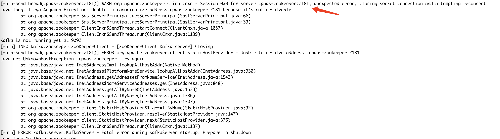

---kind:   - Troubleshootingproducts:    - Alauda Container Platform   - Alauda DevOps   - Alauda AI   - Alauda Application Services   - Alauda Service Mesh   - Alauda Developer PortalProductsVersion:   - 4.1.0,4.2.x---<!-- A type of document that involves encountering a fault, diag...it, performing root cause analysis, and providing solutions. --># 3.12.2 arm，欧拉系统，双栈 calico dns 解析超时kafka pod 域名解析超时 测试 pod 中 nslookup 查询超时，但直接访问 coredns pod IP/SVC 正常 抓包显示请求到达 coredns 节点但无响应## Cause- vxlan.calico 网卡 checksum 校验导致报文被丢弃## Resolution- 关闭 vxlan.calico 网卡 tx-checksumming: ethtool -K vxlan.calico tx-checksum-ip-generic off## [workaround]## [Related Information]**Screenshots**- Environment: EulerOS 5.10.0-60.18.0.50.oe2203.aarch64, Calico 3.24.1, ARM 架构- vxlan.calico- coredns- udp checksum- hostNetwork- dnsPolicy: ClusterFirstWithHostNet- 双栈配置- Component: CoreDNS- Page ID: 152654134- Original Title: 3.12.2 arm，欧拉系统，双栈 calico dns 解析超时