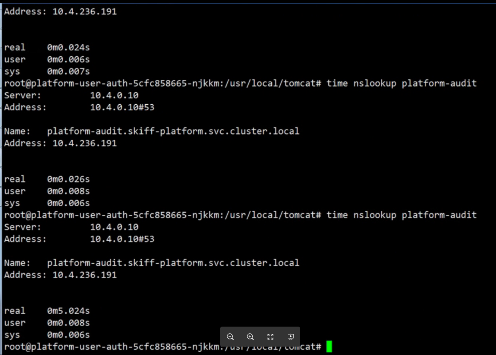
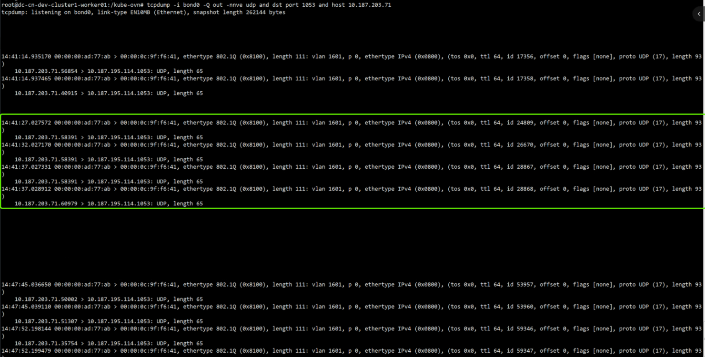

---
kind:
  - Troubleshooting
products:
  - Alauda Container Platform
  - Alauda DevOps
  - Alauda AI
  - Alauda Application Services
  - Alauda Service Mesh
  - Alauda Developer Portal
ProductsVersion:
  - 4.1.0,4.2.x
---
<!-- A type of document that involves encountering a fault, diagnosing it, performing root cause analysis, and providing solutions. -->

# coredns解析时快时慢

解析svc名称时出现5秒延迟 抓包显示交换机丢包导致重试 存在ICMP重定向报文

## Cause
- 二层网络交换机异常丢包
- 网关设备存在ip redirect配置
- 硬件速率限制导致处理延迟

## Resolution
- 检查并关闭所有网关/交换机的ip redirect配置
- 调整网关的Hardware rate limit参数

## [workaround]

## [Related Information]
**Screenshots**

- Environment: TKE 3.10.2 + kube-ovn 1.9.16 + 单网卡underlay + 麒麟系统
- coredns cache参数
- svc地址
- resolve.conf nameserver配置
- kube-ovn
- underlay网络
- Component: CoreDNS
- Page ID: 152657821
- Original Title: coredns解析时快时慢
