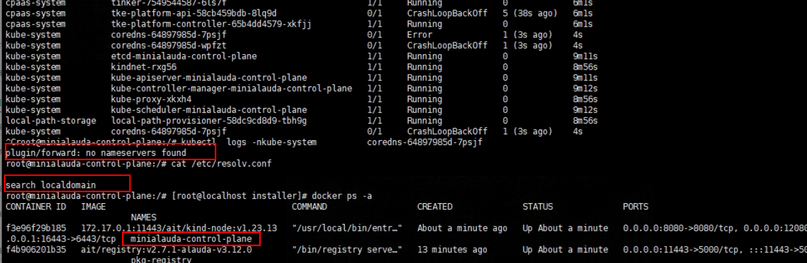

---
kind:
  - Troubleshooting
products:
  - Alauda Container Platform
  - Alauda DevOps
  - Alauda AI
  - Alauda Application Services
  - Alauda Service Mesh
  - Alauda Developer Portal
ProductsVersion:
  - 4.1.0,4.2.x
---
<!-- A type of document that involves encountering a fault, diagnosing it, performing root cause analysis, and providing solutions. -->

# 平台部署

ERROR: failed to create cluster: wait alauda container platform ready timed out coredns服务无法启动 节点本地未设置dns服务器

## Cause
- 未设置dns服务器

## Resolution
- 节点本地设置dns服务器（禁止设置为127.0.0.1）
- 删除minialauda-control-plane容器
- 重新执行setup.sh脚本

## [workaround]

## [Related Information]
**Screenshots**

- Environment: 通用
- coredns
- minialauda-control-plane
- kubectl get pod -A
- setup.sh
- Component: CoreDNS
- Page ID: 160762712
- Original Title: 平台部署-setup脚本运行失败-未设置dns服务器导致
