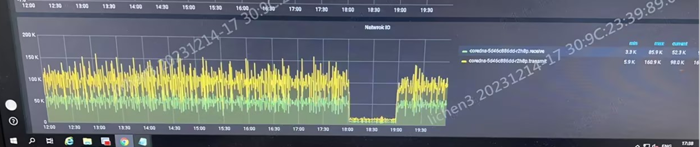

---kind:   - Troubleshootingproducts:    - Alauda Container Platform   - Alauda DevOps   - Alauda AI   - Alauda Application Services   - Alauda Service Mesh   - Alauda Developer PortalProductsVersion:   - 4.1.0,4.2.x---<!-- A type of document that involves encountering a fault, diag...it, performing root cause analysis, and providing solutions. --># CoreDNS 突发无法正常解析域名集群内应用无法解析外部域名 多个节点上的多个应用同时发生故障 应用日志显示解析失败的域名包含外部域名拼接 search 域后以 cluster.local 结尾的内部域名## Cause- 多个集群使用相同的 Pod 网段- CoreDNS 的 IP 地址被其他集群的 Pod 占用导致网络冲突## Resolution- 确保不同集群使用唯一的 Pod 网段配置- 检查并修改存在冲突的集群网络配置## [workaround]- 删除并重建 CoreDNS 副本## [Related Information]**Screenshots**- Environment: Kubernetes with Calico CNI, ACP v2.6- Pod 网段- CoreDNS- Calico- BGP- cluster.local- Component: CoreDNS- Page ID: 180977900- Original Title: CoreDNS 突发无法正常解析域名