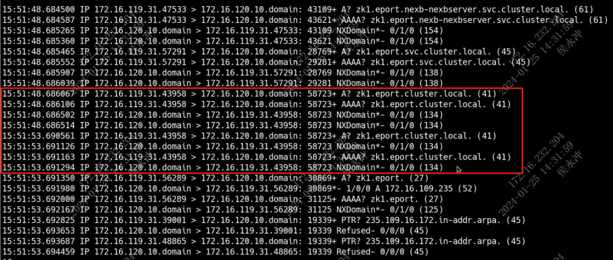
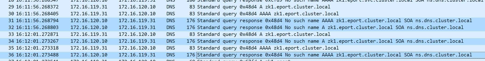

---kind:   - Troubleshootingproducts:    - Alauda Container Platform   - Alauda DevOps   - Alauda AI   - Alauda Application Services   - Alauda Service Mesh   - Alauda Developer PortalProductsVersion:   - 4.1.0,4.2.x---<!-- A type of document that involves encountering a fault, diag...it, performing root cause analysis, and providing solutions. --># DNS 域名解析偶现 5s 延迟/卡顿Pod 中访问域名时偶现 5s 延迟/卡顿 域名解析耗时 5s kube-ovn-pinger 中无此问题## Cause- 使用 debian-slim:10 作为 base 镜像存在 bug，导致收到解析结果后仍重新发起请求## Resolution- 更新 base 镜像至 debian 11 或 12 版本## [workaround]## [Related Information]**Screenshots**- Environment: 麒麟- debian-slim:10- DNS 解析- Component: CoreDNS- Page ID: 187237175- Original Title: DNS 域名解析偶现 5s 延迟/卡顿