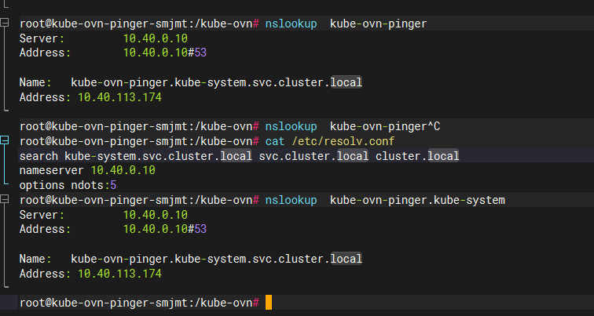
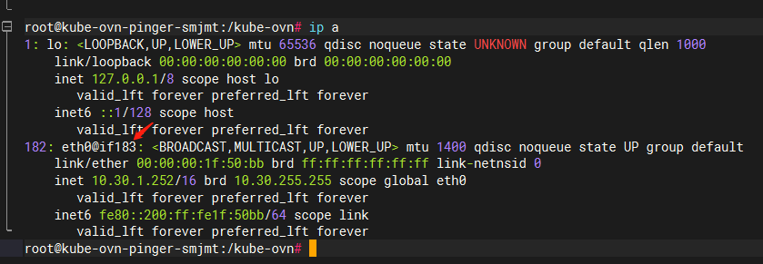
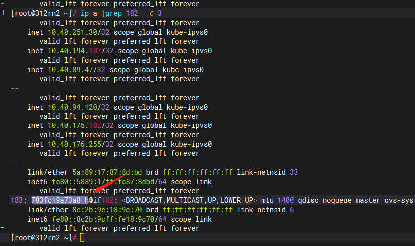
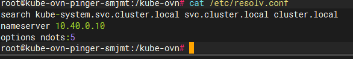
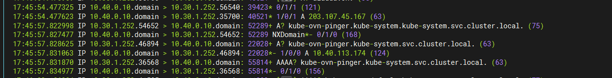

---
kind:
  - Troubleshooting
products:
  - Alauda Container Platform
  - Alauda DevOps
  - Alauda AI
  - Alauda Application Services
  - Alauda Service Mesh
  - Alauda Developer Portal
ProductsVersion:
  - 4.1.0,4.2.x
---
<!-- A type of document that involves encountering a fault, diagnosing it, performing root cause analysis, and providing solutions. -->

# coredns域名解析流程

JIRA Jira：

## Cause
- ndots 参数设置为 5，当请求域名中 "." 数量小于5时会触发 search 补全机制

## Resolution

## [workaround]

## [Related Information]
**Screenshots**

- Environment: Kubernetes 集群（适用版本：ALL）
- /etc/resolv.conf
- ndots
- search 域
- kube-system.svc.cluster.local
- svc.cluster.local
- cluster.local
- Component: CoreDNS
- Page ID: 191073288
- Original Title: coredns域名解析流程
