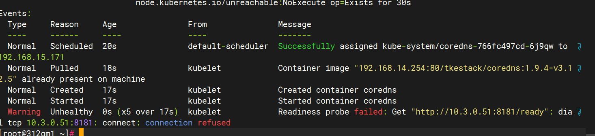
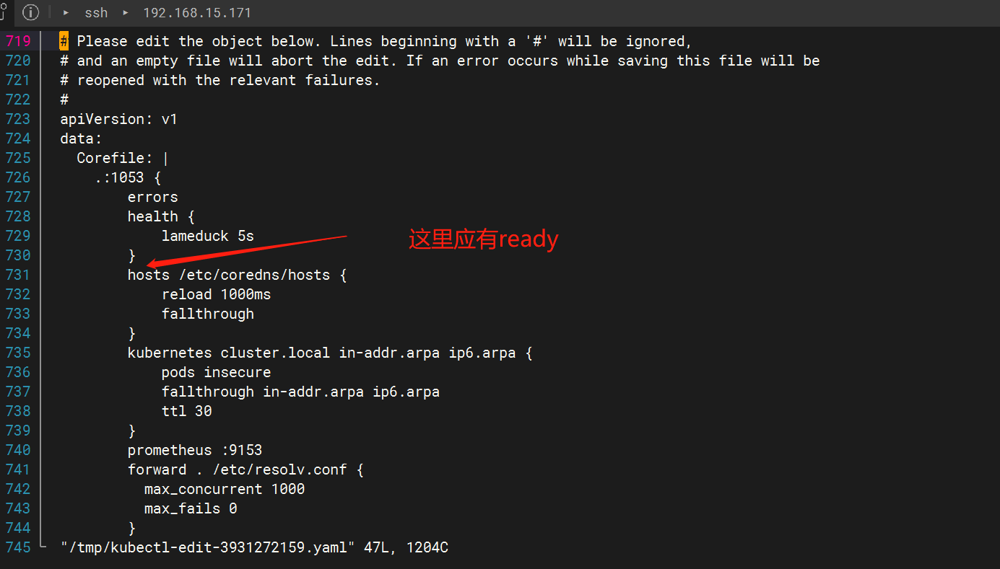

---
kind:
  - Troubleshooting
products:
  - Alauda Container Platform
  - Alauda DevOps
  - Alauda AI
  - Alauda Application Services
  - Alauda Service Mesh
  - Alauda Developer Portal
ProductsVersion:
  - 4.1.0,4.2.x
---
<!-- A type of document that involves encountering a fault, diagnosing it, performing root cause analysis, and providing solutions. -->

# coredns一直处于未就绪状态，0/1running

coredns pod处于0/1 running状态 readiness探针持续失败

## Cause
- coredns的configmap缺少ready模块

## Resolution
- 补全configmap中的ready模块配置并重启pod

## [workaround]

## [Related Information]
**Screenshots**

- Environment: 通用
- coredns configmap
- readiness探针
- ready插件
- kubernetes插件
- Component: CoreDNS
- Page ID: 192644393
- Original Title: coredns一直处于未就绪状态，0/1running
