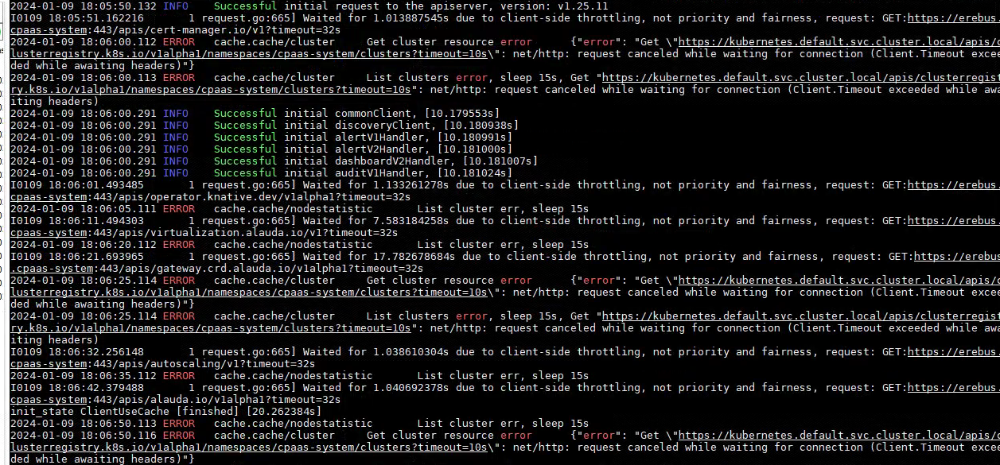

---
kind:
  - Troubleshooting
products:
  - Alauda Container Platform
  - Alauda DevOps
  - Alauda AI
  - Alauda Application Services
  - Alauda Service Mesh
  - Alauda Developer Portal
ProductsVersion:
  - 4.1.0,4.2.x
---
<!-- A type of document that involves encountering a fault, diagnosing it, performing root cause analysis, and providing solutions. -->

# 监控

grafana监控面板报错“cluster xxx not found” apollo组件日志报错无法解析svc域名

## Cause
- global集群主机dns配置存在search域导致apollo组件解析异常

## Resolution
- 注释dns search域配置
- 重启coredns和kube-proxy组件

## [workaround]

## [Related Information]
**Screenshots**

- Environment: 3-12
- apollo
- coredns
- kube-proxy
- svc域名
- search域配置
- Component: CoreDNS
- Page ID: 194054907
- Original Title: 运维中心-监控-grafana监控面板异常
