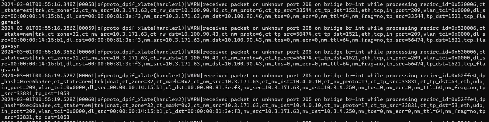
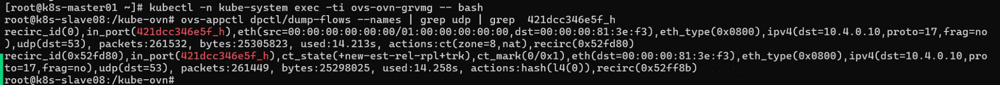

---
kind:
  - Troubleshooting
products:
  - Alauda Container Platform
  - Alauda DevOps
  - Alauda AI
  - Alauda Application Services
  - Alauda Service Mesh
  - Alauda Developer Portal
ProductsVersion:
  - 4.1.0,4.2.x
---
<!-- A type of document that involves encountering a fault, diagnosing it, performing root cause analysis, and providing solutions. -->

# ovs

Pod无法解析域名但可通过Service IP访问 ovs-vswitchd日志报错: ofproto_dpif_xlate: received packet on unknown port ovs UDP conntrack存在异常源IP记录

## Cause
- ovs-ovn组件状态异常导致无效端口映射
- 连接跟踪表存在异常条目

## Resolution
- 删除并重建故障节点上的ovs-ovn pod

## [workaround]

## [Related Information]
**Screenshots**

- Environment: Kylin Linux Advanced Server V10 (4.19.90-52.22.v2207.ky10.x86_64)
- ovs-vswitchd
- ovn-controller
- coredns service ip
- UDP conntrack
- Component: CoreDNS
- Page ID: 195494263
- Original Title: ovs-vswitchd 报错：ofproto_dpif_xlate: received packet on unknown port
