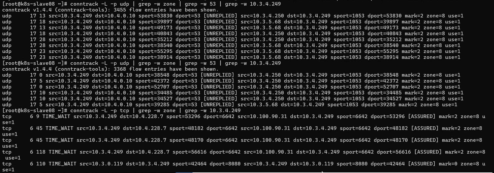

---kind:   - Troubleshootingproducts:    - Alauda Container Platform   - Alauda DevOps   - Alauda AI   - Alauda Application Services   - Alauda Service Mesh   - Alauda Developer PortalProductsVersion:   - 4.1.0,4.2.x---<!-- A type of document that involves encountering a fault, diag...it, performing root cause analysis, and providing solutions. --># ovspod无法解析域名但可通过service IP访问 节点未向coredns节点发送封装DNS请求 ovs-vswitchd日志报错: ofproto_dpif_xlate: received packet on unknown port## Cause- OVS端口映射异常- ovs-ovn组件状态异常## Resolution- 删除并重建故障节点上的ovs-ovn pod## [workaround]## [Related Information]**Screenshots**- Environment: Kylin Linux V10 (4.19.90-52.22.v2207.ky10.x86_64)- ovs-vswitchd- ovn-controller- coredns- kubectl ko trace- conntrack- Component: CoreDNS- Page ID: 195494263- Original Title: ovs-vswitchd 报错：ofproto_dpif_xlate: received packet on unknown port