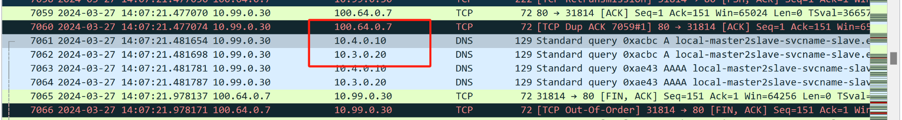
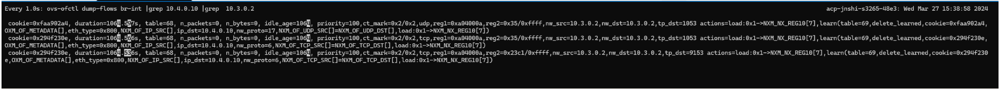
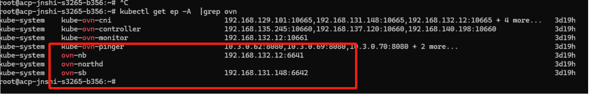
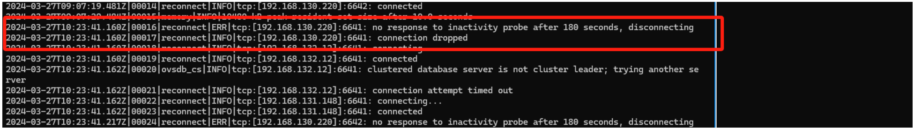
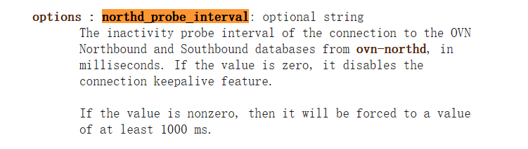

---
kind:
  - Troubleshooting
products:
  - Alauda Container Platform
  - Alauda DevOps
  - Alauda AI
  - Alauda Application Services
  - Alauda Service Mesh
  - Alauda Developer Portal
ProductsVersion:
  - 4.1.0,4.2.x
---
<!-- A type of document that involves encountering a fault, diagnosing it, performing root cause analysis, and providing solutions. -->

# coredns所在的节点断电，通过svcname访问应用中断时间超过30s，实际为150s

通过svcname访问应用中断时间约150秒 pod的DNS请求流量在ep切换后仍被DNAT到已断电的coredns节点

## Cause
- ovn-northd的northd_probe_interval参数默认设置为180000ms（180秒），导致节点断电后连接释放延迟

## Resolution
- 修改ovn-northd的northd_probe_interval参数为5000ms，加速探测与连接释放

## [workaround]

## [Related Information]
**Screenshots**

- Environment: CNI版本: kube-ovn v1.12.8
- coredns
- kube-ovn
- ovn-nb
- ovn-sb
- ovn-northd
- northd_probe_interval
- Component: CoreDNS
- Page ID: 198258441
- Original Title: coredns所在的节点断电，通过svcname访问应用中断时间超过30s，实际为150s
