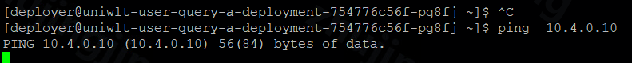
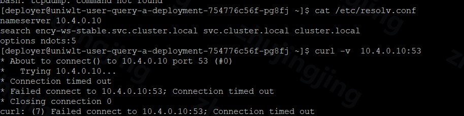

---
kind:
  - Troubleshooting
products:
  - Alauda Container Platform
  - Alauda DevOps
  - Alauda AI
  - Alauda Application Services
  - Alauda Service Mesh
  - Alauda Developer Portal
ProductsVersion:
  - 4.1.0,4.2.x
---
<!-- A type of document that involves encountering a fault, diagnosing it, performing root cause analysis, and providing solutions. -->

# underlay pod 访问coredns 不通

Underlay Pod 无法通过ICMP(ping)访问CoreDNS的Service IP

## Cause
- Underlay子网与Overlay子网默认不互通

## Resolution
- 编辑subnet子网yaml，在spec字段下添加u2oInterconnection: true配置

## [workaround]

## [Related Information]
**Screenshots**

- Environment: 3.12.0
- subnet.yaml
- coredns service
- u2oInterconnection
- Component: CoreDNS
- Page ID: 204507782
- Original Title: 容器平台-underlay pod 访问coredns 不通-78456
