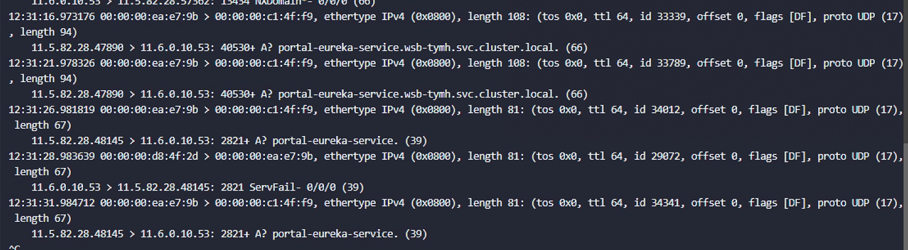
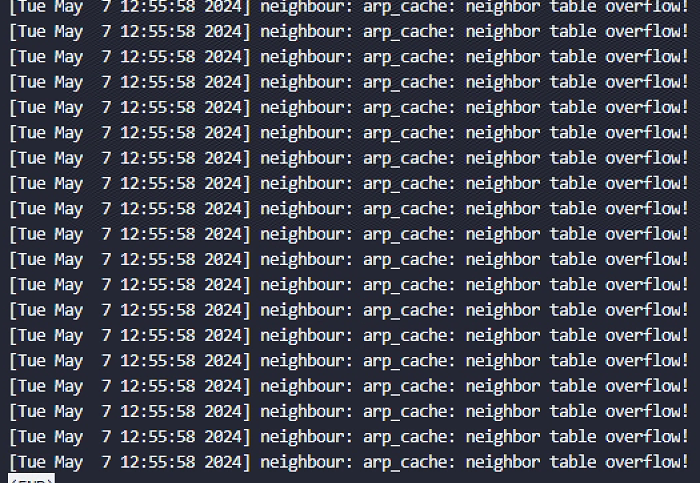
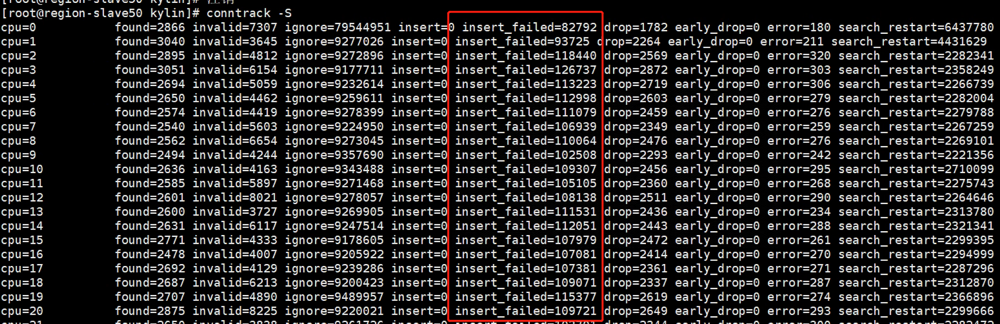
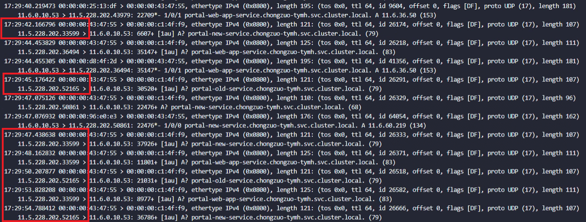
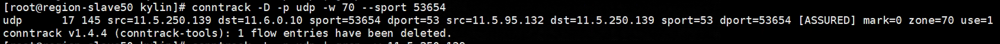

---kind:   - Troubleshootingproducts:    - Alauda Container Platform   - Alauda DevOps   - Alauda AI   - Alauda Application Services   - Alauda Service Mesh   - Alauda Developer PortalProductsVersion:   - 4.1.0,4.2.x---<!-- A type of document that involves encountering a fault, diag...it, performing root cause analysis, and providing solutions. --># 偶现 DNS 域名解析失败或超时业务 Pod 解析同 namespace 的 Service 名称偶现失败或超时 nslookup 使用 CoreDNS Service IP 复现故障 抓包显示 DNS 请求无回包## Cause- ARP 表溢出导致网络异常- 内核 conntrack 模块存在 bug 导致条目失败- 源端口冲突引发 conntrack 条目冲突## Resolution- 调整 net.ipv4.neigh.default.gc_thresh1=8192- 调整 net.ipv4.neigh.default.gc_thresh2=16384- 调整 net.ipv4.neigh.default.gc_thresh3=32768- 将参数写入 /etc/sysctl.conf- 重建受影响的 Pod- 手动清理 OVS conntrack 的 UDP 条目## [workaround]## [Related Information]**Screenshots**- Environment: ACP v3.6, Kubernetes, Kube-OVN CNI, 6 CoreDNS 副本,  }- CoreDNS- Kube-OVN- conntrack- OVS conntrack- net.ipv4.neigh.default.gc_thresh1- 10.96.0.10- Component: CoreDNS- Page ID: 207398785- Original Title: 偶现 DNS 域名解析失败或超时