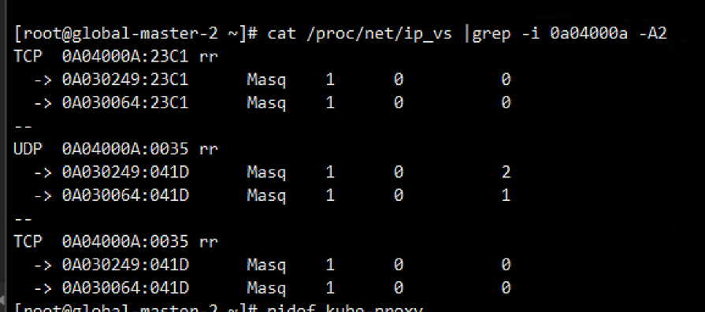
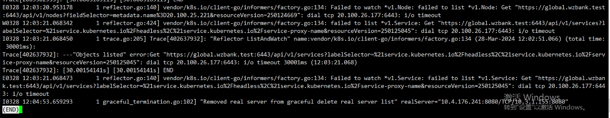
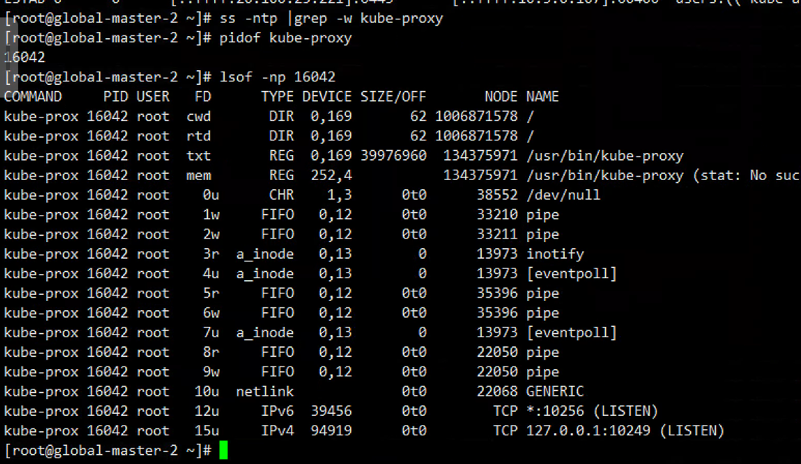
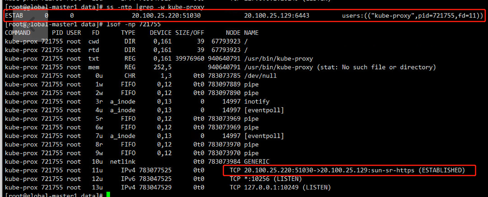
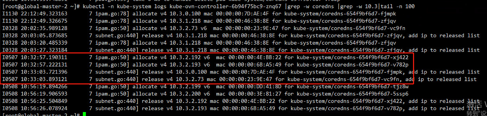

---kind:   - Troubleshootingproducts:    - Alauda Container Platform   - Alauda DevOps   - Alauda AI   - Alauda Application Services   - Alauda Service Mesh   - Alauda Developer PortalProductsVersion:   - 4.1.0,4.2.x---<!-- A type of document that involves encountering a fault, diag...it, performing root cause analysis, and providing solutions. --># 主机网络无法解析集群内域名主机网络 Pod 无法解析集群内域名，容器网络 Pod 正常 nslookup 通过 CoreDNS Service IP 解析超时失败 节点 ovn0 抓包显示目的 IP 与当前 CoreDNS Pod IP 不一致## Cause- kube-proxy 未更新 IPVS 规则- 节点迁移后未重建 kube-proxy 导致残留旧配置## Resolution- 删除并重建故障节点 kube-proxy: kubectl delete pod -n kube-system -l k8s-app=kube-proxy## [workaround]## [Related Information]**Screenshots**- Environment: Kubernetes v1.25.6, CNI: Kube-OVN- Service IP- CoreDNS- kube-proxy- IPVS- ovn0- API Server 地址- Component: CoreDNS- Page ID: 207399110- Original Title: 主机网络无法解析集群内域名