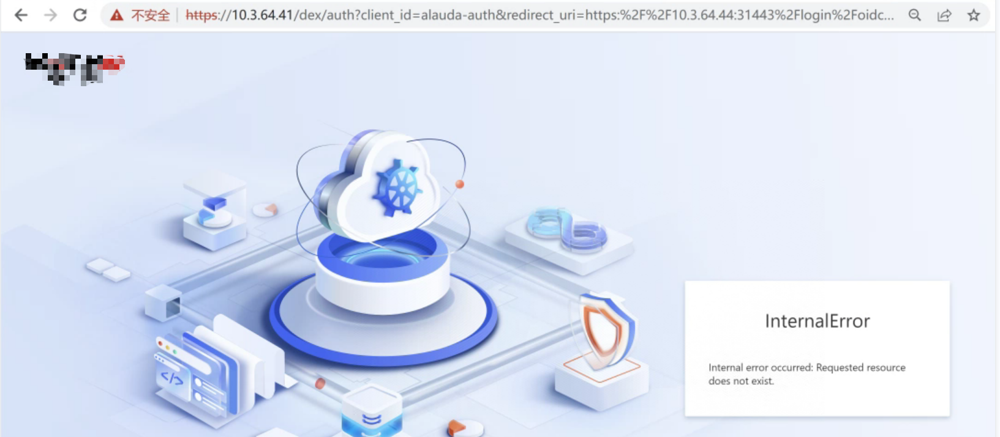

---
kind:
  - Troubleshooting
products:
  - Alauda Container Platform
  - Alauda DevOps
  - Alauda AI
  - Alauda Application Services
  - Alauda Service Mesh
  - Alauda Developer Portal
ProductsVersion:
  - 4.1.0,4.2.x
---
<!-- A type of document that involves encountering a fault, diagnosing it, performing root cause analysis, and providing solutions. -->

# 3.14.2

aml页面一直加载中，无法显示数据 请求返回发现访问gitlab有问题

## Cause
- 访问平台电脑未配置gitlab域名的hosts解析

## Resolution
- 在访问平台电脑的/etc/hosts中添加gitlab域名解析记录

## [workaround]

## [Related Information]
**Screenshots**

- Environment: 3.14.2
- gitlab域名
- coredns解析
- dex-configmap
- /etc/hosts
- Component: CoreDNS
- Page ID: 210438480
- Original Title: 3.14.2-容器平台-aml平台访问故障
