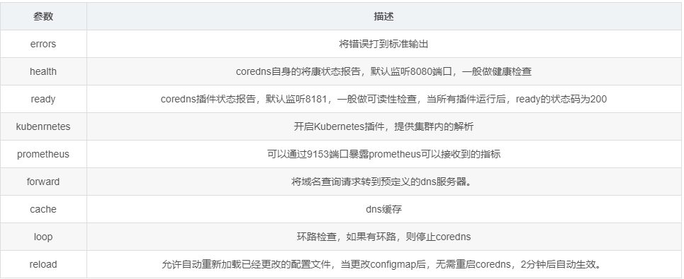
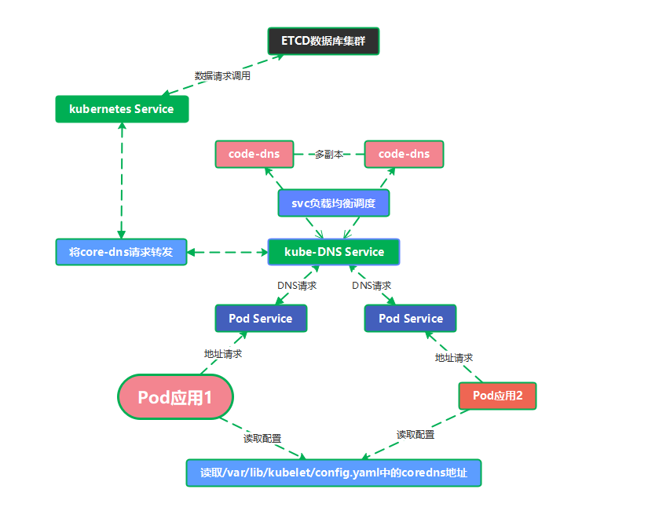
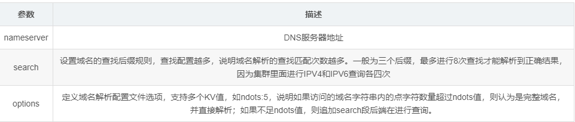

---
kind:
  - Troubleshooting
products:
  - Alauda Container Platform
  - Alauda DevOps
  - Alauda AI
  - Alauda Application Services
  - Alauda Service Mesh
  - Alauda Developer Portal
ProductsVersion:
  - 4.1.0,4.2.x
---
<!-- A type of document that involves encountering a fault, diagnosing it, performing root cause analysis, and providing solutions. -->

# 域名解析（coredns）

Pod无法解析集群内部服务域名 外部域名解析失败 DNS查询响应延迟或超时

## Cause
- CoreDNS配置中forward指令指向错误的上游DNS服务器
- hosts文件自定义记录配置错误
- ndots设置过高导致查询流程异常
- 节点/etc/resolv.conf配置问题影响上游解析

## Resolution
- 检查ConfigMap中kubernetes插件配置的cluster.local后缀
- 验证forward配置的/etc/resolv.conf有效性
- 调整options ndots参数降低查询复杂度
- 检查hosts块中静态记录的正确性

## [workaround]
- 在Pod spec中临时设置dnsConfig覆盖ndots参数
- 直接使用集群服务全限定域名(FQDN)

## [Related Information]
**Screenshots**

- Environment: Kubernetes集群环境，使用CoreDNS v3.12.5作为集群DNS服务器
- coredns-configmap
- kube-dns service
- /etc/coredns/hosts
- /etc/resolv.conf
- 1053
- 9153
- cluster.local
- forward配置
- ndots参数
- Component: CoreDNS
- Page ID: 211780350
- Original Title: 域名解析（coredns）
