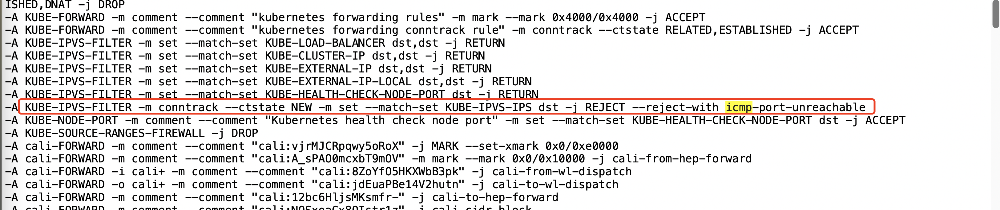

---kind:   - Troubleshootingproducts:    - Alauda Container Platform   - Alauda DevOps   - Alauda AI   - Alauda Application Services   - Alauda Service Mesh   - Alauda Developer PortalProductsVersion:   - 4.1.0,4.2.x---<!-- A type of document that involves encountering a fault, diag...it, performing root cause analysis, and providing solutions. --># 华为智慧园区，ACP 3.16 ping svc 地址不通容器pod无法ping通svc地址 业务pod启动异常 curl svc访问正常## Cause- 节点iptables规则限制访问- kube-ipvs0的svc地址访问受限## Resolution- 客户修改业务逻辑## [workaround]## [Related Information]**Screenshots**- Environment: ACP 3.16- kube-ipvs0- iptables- svc地址- kube-proxy IPVS模式- Component: CoreDNS- Page ID: 221885748- Original Title: 华为智慧园区，ACP 3.16 ping svc 地址不通