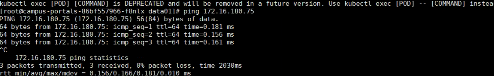
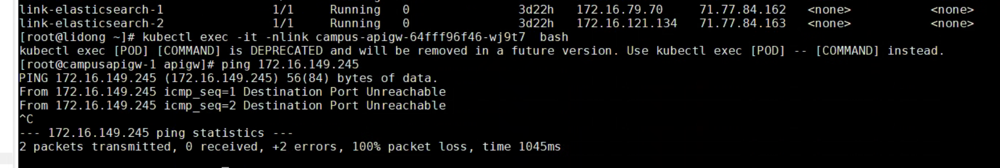

---
kind:
  - Troubleshooting
products:
  - Alauda Container Platform
  - Alauda DevOps
  - Alauda AI
  - Alauda Application Services
  - Alauda Service Mesh
  - Alauda Developer Portal
ProductsVersion:
  - 4.1.0,4.2.x
---
<!-- A type of document that involves encountering a fault, diagnosing it, performing root cause analysis, and providing solutions. -->

# 华为智慧园区，ACP 3.16 ping svc 地址不通

容器pod无法ping通svc地址 curl svc访问正常，DNS解析正常 kube-ipvs0的svc地址访问受iptables规则限制

## Cause
- kube-ipvs0的svc地址访问被iptables规则限制
- ACP 3.16版本可能引入的网络策略或虚拟机模板变更

## Resolution
- 客户修改业务逻辑

## [workaround]

## [Related Information]
**Screenshots**

- Environment: ACP 3.16
- kube-ipvs0
- iptables
- svc地址
- DNS
- Component: CoreDNS
- Page ID: 221885748
- Original Title: 华为智慧园区，ACP 3.16 ping svc 地址不通
