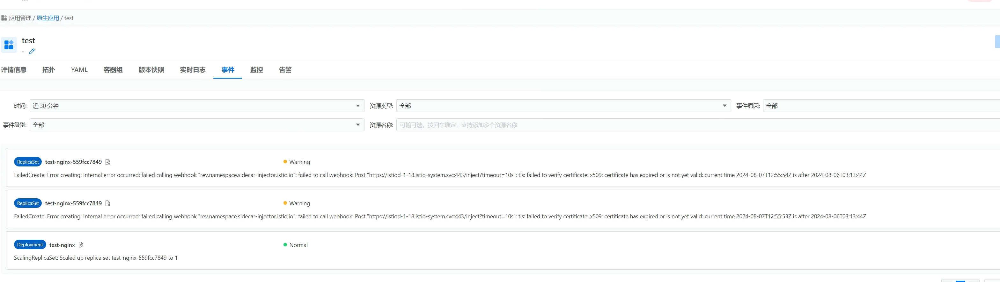
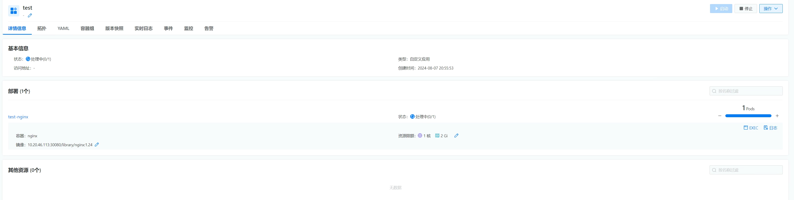
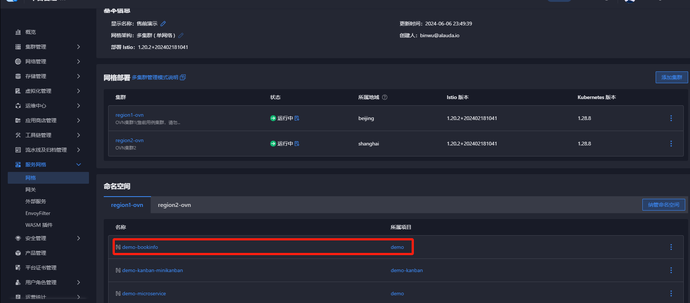
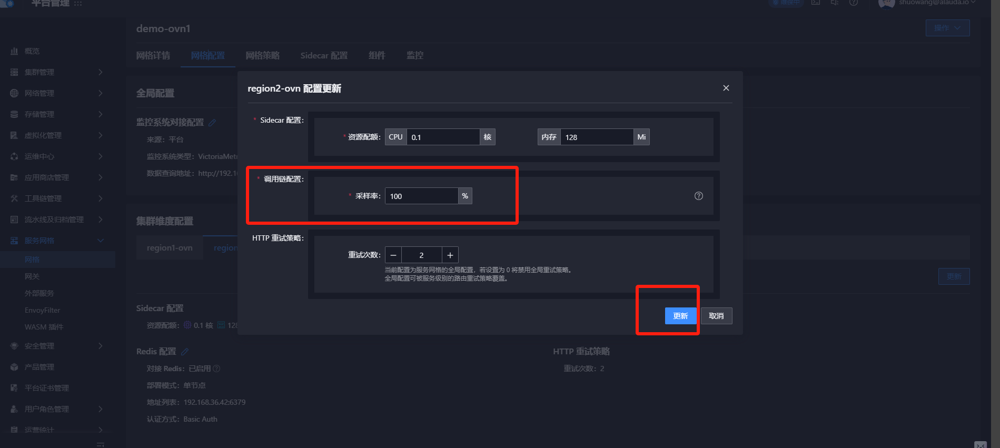

---
kind:
  - Troubleshooting
products:
  - Alauda Container Platform
  - Alauda DevOps
  - Alauda AI
  - Alauda Application Services
  - Alauda Service Mesh
  - Alauda Developer Portal
ProductsVersion:
  - 4.1.0,4.2.x
---
<!-- A type of document that involves encountering a fault, diagnosing it, performing root cause analysis, and providing solutions. -->

# 涉及微服务注册所在命名空间，所有服务pod无法启动日志提示无法连接isitio的sidecar的svc

所有服务pod无法启动，日志提示无法连接istio的sidecar的svc 新建pod也存在相同提示 存在asm相关注册行为的podyaml

## Cause
- asm-controller-webhook证书过期（cert-manager证书续期失败）

## Resolution
- 解除纳管命名空间
- 更新服务网关配置（例如采集率）以重新触发证书续期
- 后续版本将证书有效期延长至10年

## [workaround]
- 解除纳管命名空间

## [Related Information]
**Screenshots**

- Environment: 3.14.1
- asm-controller-webhook
- cert-manager
- 服务网格命名空间绑定
- coredns
- Component: CoreDNS
- Page ID: 228557690
- Original Title: 涉及微服务注册所在命名空间，所有服务pod无法启动日志提示无法连接isitio的sidecar的svc
