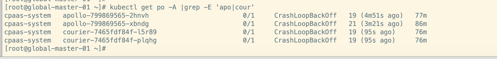
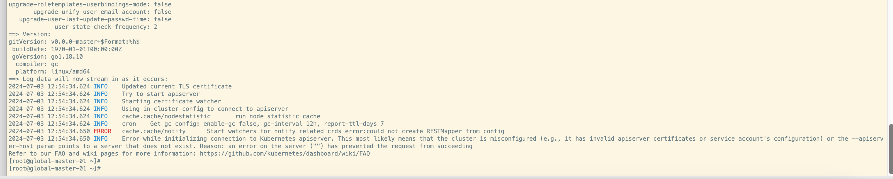
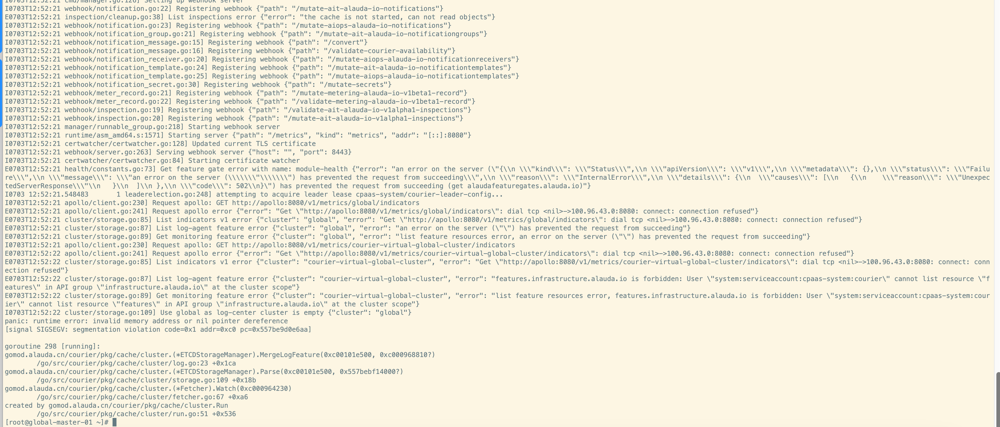

---
kind:
  - Troubleshooting
products:
  - Alauda Container Platform
  - Alauda DevOps
  - Alauda AI
  - Alauda Application Services
  - Alauda Service Mesh
  - Alauda Developer Portal
ProductsVersion:
  - 4.1.0,4.2.x
---
<!-- A type of document that involves encountering a fault, diagnosing it, performing root cause analysis, and providing solutions. -->

# v3.12

apollo日志显示连接apiserver超时 courier组件日志报错连接apollo失败

## Cause
- global使用域名部署但未配置域名解析，导致域名无法解析

## Resolution
- 手动配置global集群的coredns域名解析

## [workaround]

## [Related Information]
**Screenshots**

- Environment: 3.12.1
- apollo
- courier
- coredns
- 域名解析
- Component: CoreDNS
- Page ID: 231113011
- Original Title: v3.12-基础架构-创建global过程中apollo和courier异常
