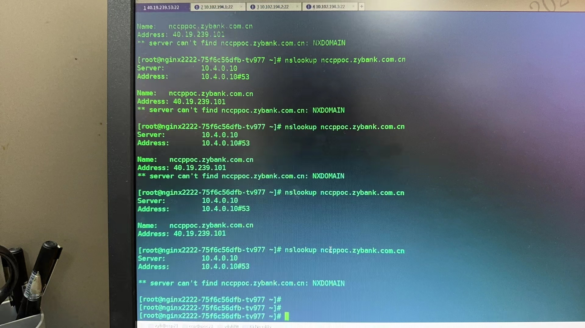
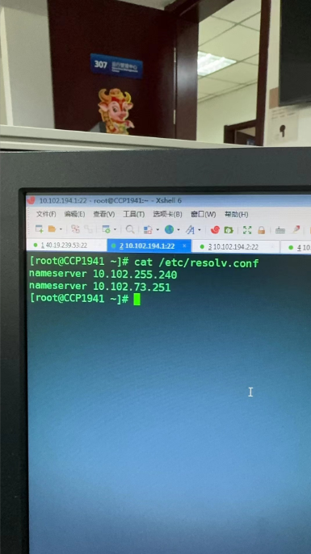
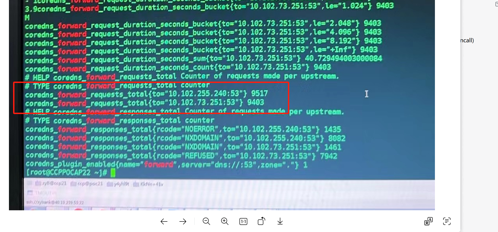
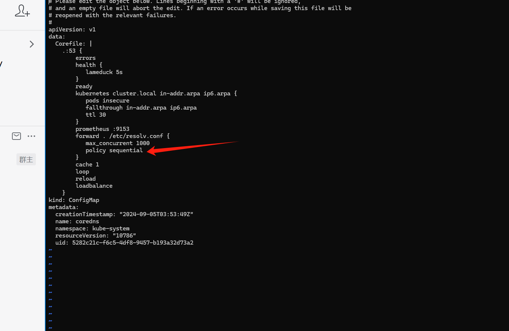

---
kind:
  - Troubleshooting
products:
  - Alauda Container Platform
  - Alauda DevOps
  - Alauda AI
  - Alauda Application Services
  - Alauda Service Mesh
  - Alauda Developer Portal
ProductsVersion:
  - 4.1.0,4.2.x
---
<!-- A type of document that involves encountering a fault, diagnosing it, performing root cause analysis, and providing solutions. -->

# 中原银行 业务pod 解析外部域名偶现失败

偶现业务pod解析外部域名失败

## Cause
- 节点/etc/resolv.conf中存在未正确配置的nameserver 10.102.73.251
- coredns默认随机选择上游nameserver导致可能选中问题服务器

## Resolution
- 配置coredns forward policy为sequential

## [workaround]

## [Related Information]
**Screenshots**

- Environment: Kubernetes版本未明确，CNI版本：acp 3.8，coredns版本：1.7.0
- coredns
- forward policy
- /etc/resolv.conf
- 53端口
- http://{kube-dns ip}:53/metrics
- Component: CoreDNS
- Page ID: 231116449
- Original Title: 中原银行 业务pod 解析外部域名偶现失败
