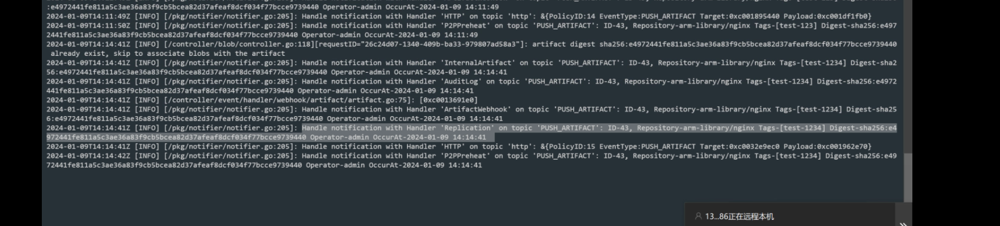
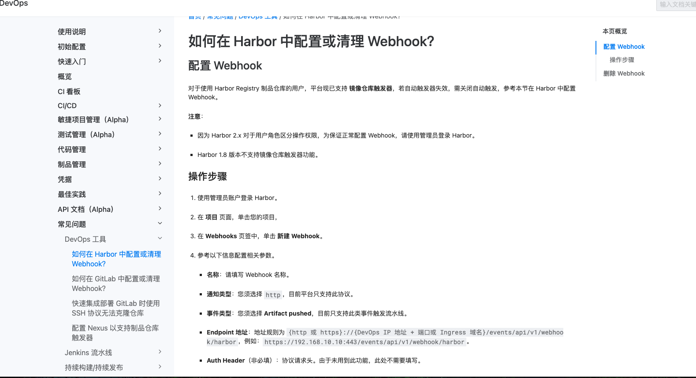
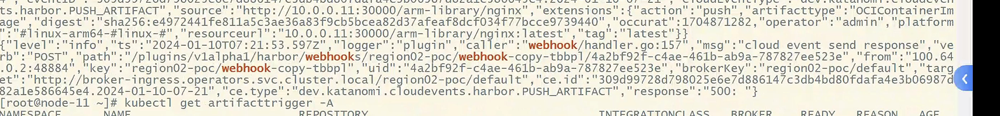
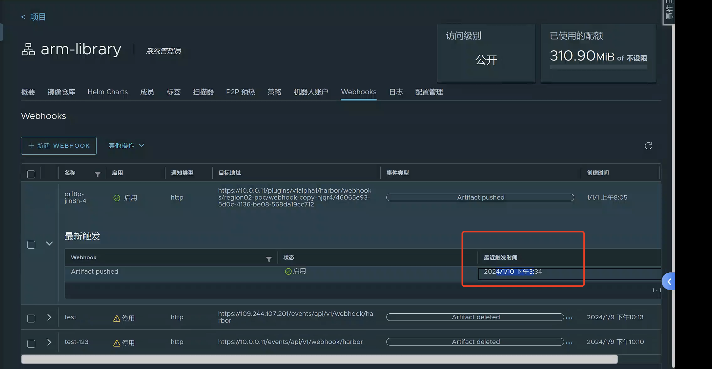
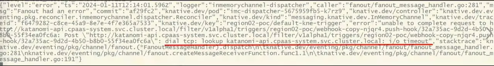
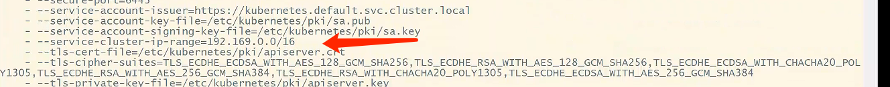
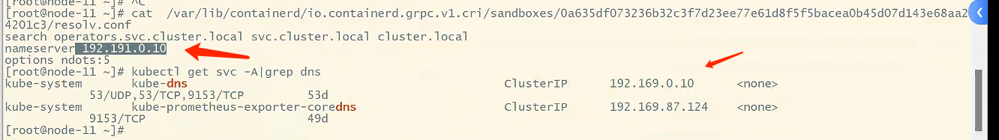

---
kind:
  - Troubleshooting
products:
  - Alauda Container Platform
  - Alauda DevOps
  - Alauda AI
  - Alauda Application Services
  - Alauda Service Mesh
  - Alauda Developer Portal
ProductsVersion:
  - 4.1.0,4.2.x
---
<!-- A type of document that involves encountering a fault, diagnosing it, performing root cause analysis, and providing solutions. -->

# devops中的镜像触发器配置后，上传镜像无法触发

上传镜像无法触发镜像触发器 手动创建webhook不生效 katanomi-plugin日志显示webhook返回500错误

## Cause
- imc dispatcher到katanomi-api通信超时
- pod的resolv.conf文件中coredns服务地址配置错误（非192.169.0.10）
- etcd恢复后未更新svc IP导致DNS解析异常

## Resolution
- 重启所有pod以重新加载resolv.conf配置
- 验证coredns服务地址已更新为192.169.0.10

## [workaround]

## [Related Information]
**Screenshots**

- Environment: 3.14.1
- katanomi-plugin
- imc dispatcher
- coredns
- resolv.conf
- k8s svc IP
- Component: CoreDNS
- Page ID: 232491306
- Original Title: Devops-devops中的镜像触发器配置后，上传镜像无法触发
