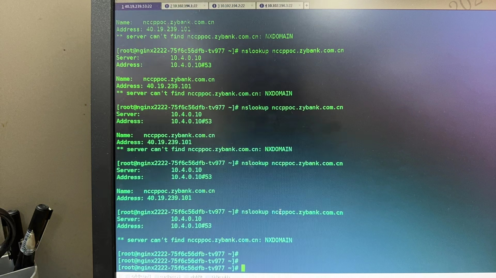
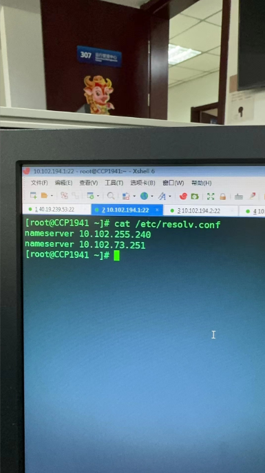
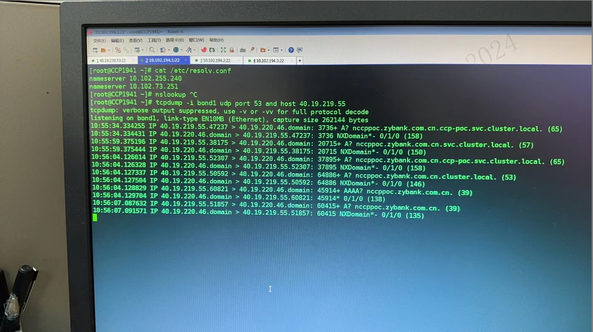
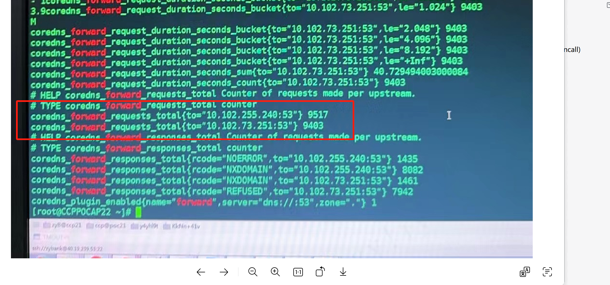
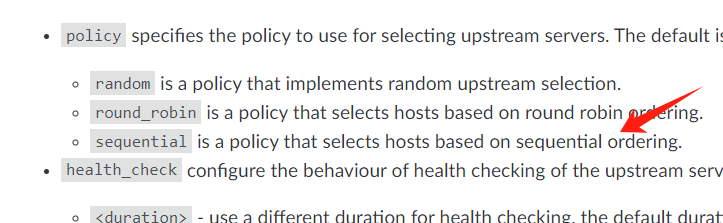
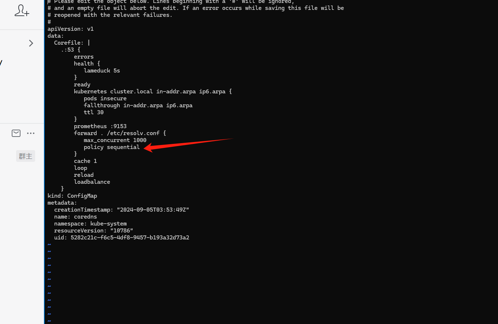

---
kind:
  - Troubleshooting
products:
  - Alauda Container Platform
  - Alauda DevOps
  - Alauda AI
  - Alauda Application Services
  - Alauda Service Mesh
  - Alauda Developer Portal
ProductsVersion:
  - 4.1.0,4.2.x
---
<!-- A type of document that involves encountering a fault, diagnosing it, performing root cause analysis, and providing solutions. -->

# coredns解析外部域名偶现失败

业务pod内解析外部域名偶现失败 业务pod的dns policy为clusterfirst 抓包显示域名解析请求发往coredns容器但失败

## Cause
- coredns默认随机轮询/etc/resolv.conf配置的nameserver
- 其中一个nameserver(10.102.255.240)无法解析特定外部域名

## Resolution
- 在Corefile中为forward插件添加sequential参数
- 配置示例：forward . /etc/resolv.conf {sequential}

## [workaround]

## [Related Information]
**Screenshots**

- Environment: 通用版本
- coredns forward插件
- /etc/resolv.conf
- dns policy: ClusterFirst
- 10.102.255.240
- 10.102.73.251
- Component: CoreDNS
- Page ID: 236323337
- Original Title: coredns解析外部域名偶现失败
