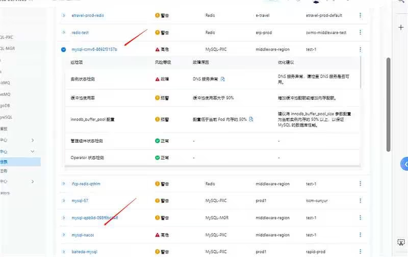
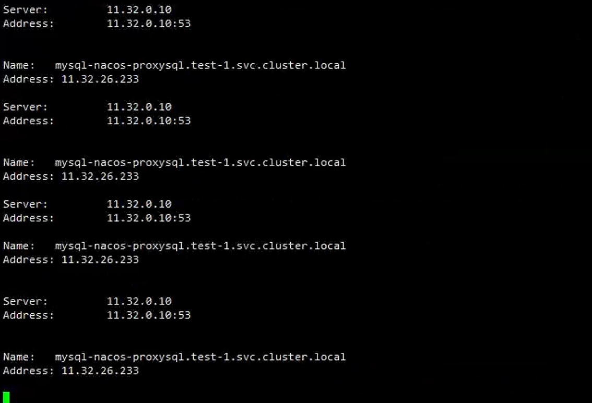
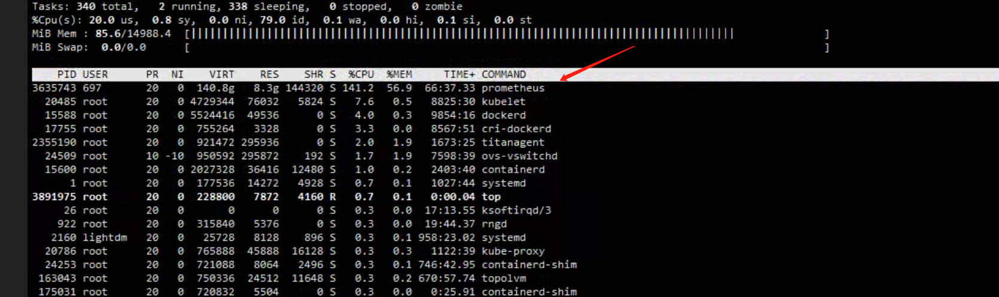

---kind:   - Troubleshootingproducts:    - Alauda Container Platform   - Alauda DevOps   - Alauda AI   - Alauda Application Services   - Alauda Service Mesh   - Alauda Developer PortalProductsVersion:   - 4.1.0,4.2.x---<!-- A type of document that involves encountering a fault, diag...it, performing root cause analysis, and providing solutions. --># 中化集团 dataservice 的 巡回检查偶现报DNS服务异常巡回检查偶现DNS解析失败 应用DNS解析超时设置为1s 系统资源紧张## Cause- DNS查询超时阈值设置过短(1s)- 内存资源不足导致响应延迟## Resolution- 扩容缓解资源压力- 调整应用DNS查询超时到5s## [workaround]## [Related Information]**Screenshots**- Environment: acp 3.14.1- inspection-operator pod- nslookup脚本- mysql-nacos巡回检查- dns解析超时配置- Component: CoreDNS- Page ID: 252510547- Original Title: 中化集团 dataservice 的 巡回检查偶现报DNS服务异常