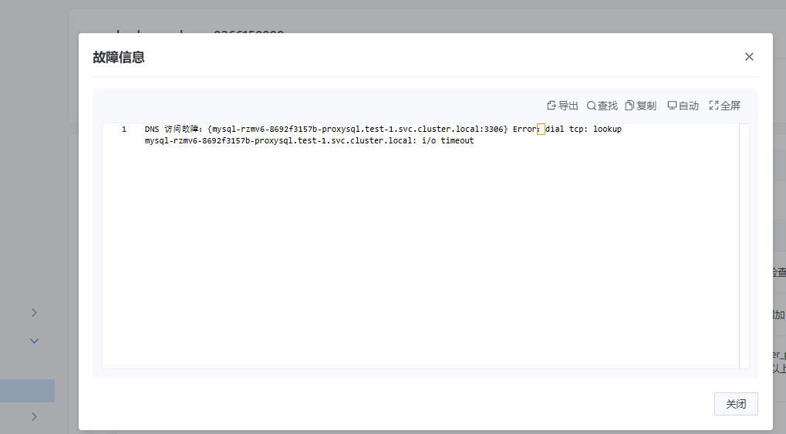

---
kind:
  - Troubleshooting
products:
  - Alauda Container Platform
  - Alauda DevOps
  - Alauda AI
  - Alauda Application Services
  - Alauda Service Mesh
  - Alauda Developer Portal
ProductsVersion:
  - 4.1.0,4.2.x
---
<!-- A type of document that involves encountering a fault, diagnosing it, performing root cause analysis, and providing solutions. -->

# 中化集团 dataservice 的 巡回检查偶现报DNS服务异常

巡回检查偶现DNS解析失败 nslookup测试无异常但应用仍报错

## Cause
- 应用设置的DNS解析超时时间过短（1s）
- 环境内存资源紧张导致响应延迟

## Resolution
- 扩容缓解资源压力
- 将应用DNS查询超时时间调整为5s

## [workaround]

## [Related Information]
**Screenshots**

- Environment: acp 3.14.1
- inspection-operator
- mysql-nacos
- dns解析超时配置
- Component: CoreDNS
- Page ID: 252510547
- Original Title: 中化集团 dataservice 的 巡回检查偶现报DNS服务异常
