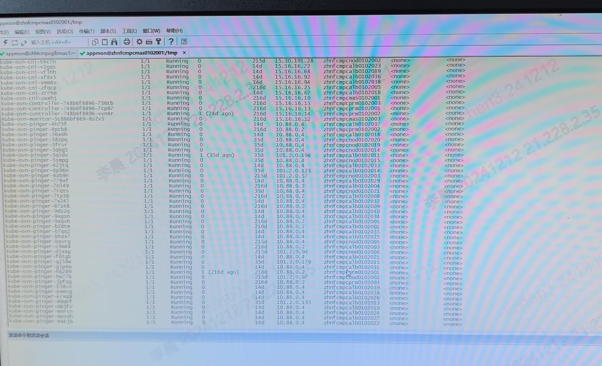
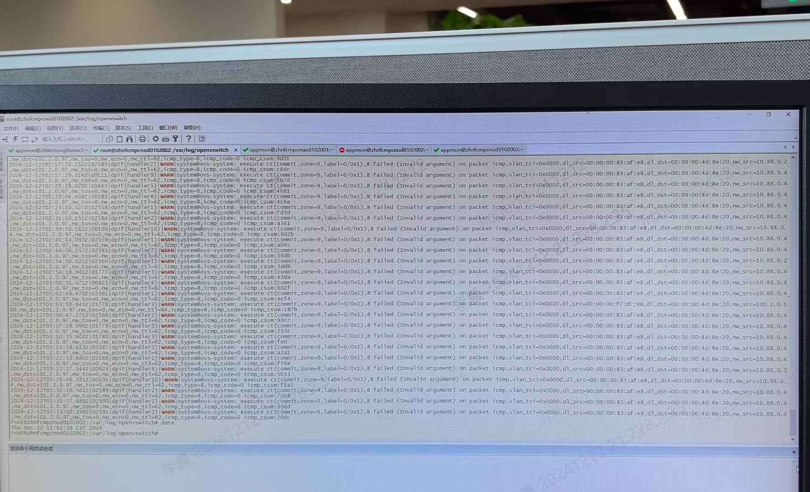
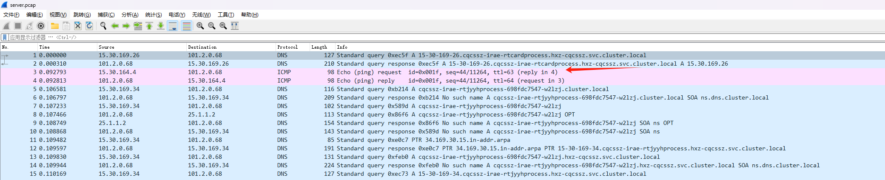
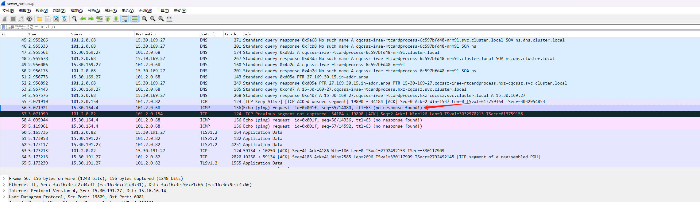

---kind:   - Troubleshootingproducts:    - Alauda Container Platform   - Alauda DevOps   - Alauda AI   - Alauda Application Services   - Alauda Service Mesh   - Alauda Developer PortalProductsVersion:   - 4.1.0,4.2.x---<!-- A type of document that involves encountering a fault, diag...it, performing root cause analysis, and providing solutions. --># 中信银行underlay pod无法访问overlay的coredns 同一主机上的另一个副本能通，但新创建的pod仍不通 coredns的回复报文未到达物理网卡## Cause- podman导致IP冲突或占用ovs-vswitchd资源- ovs-vswitchd的ct规则冲突或数据结构打满## Resolution- 重启问题节点的ovs-ovn组件- 卸载podman并清理冲突配置## [workaround]- 临时重启业务节点的ovs-ovn## [Related Information]**Screenshots**- kube-ovn-pinger- podman- cni0- ovs-vswitchd- ct规则- Component: CoreDNS- Page ID: 252510575- Original Title: 中信银行 - underlay pod无法访问overlay 的coredns